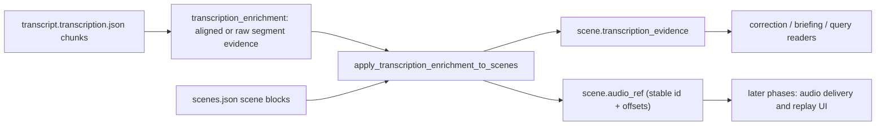

# Phase 1: Evidence-Based Audio Mapping - Research

**Researched:** 2026-04-17
**Domain:** OpenMy scene artifact enrichment inside an existing local-first Python pipeline
**Confidence:** HIGH

<user_constraints>
## User Constraints (from CONTEXT.md)

### Locked Decisions
- `audio_ref` must be derived from `transcription_evidence`, never from reverse-matching scene text
- `audio_ref` must store stable identifiers and offsets only; no `chunk_path` or absolute audio path
- Missing or ambiguous evidence must fail safe by leaving the scene without a playable `audio_ref`
- The run pipeline must attach scene audio refs whenever enrichment data exists, not only behind a manual align flag
- Existing scene JSON rewrites and historical readers must stay compatible

### the agent's Discretion
- Exact helper names and file-level decomposition
- Whether to include optional metadata such as `segment_ids` or `source`
- Whether unavailable refs are represented by omission alone or by omission plus an internal reason field

### Deferred Ideas (OUT OF SCOPE)
- Audio HTTP endpoint and Range handling
- Scene playback UI
- Correction replay anchors and fallback playback
- Waveform previews and extra transcoding

**If no CONTEXT.md exists:** not applicable for this phase
</user_constraints>

<architectural_responsibility_map>
## Architectural Responsibility Map

| Capability | Primary Tier | Secondary Tier | Rationale |
|------------|-------------|----------------|-----------|
| Derive scene audio references from existing evidence | API/Backend | Database/Storage | `transcription_enrichment.py` already reads transcription payloads and rewrites `scenes.json` |
| Persist stable scene audio reference fields | Database/Storage | API/Backend | The durable source is the day artifact, not an in-memory mapping |
| Decide when enrichment-derived fields are written during runs | API/Backend | — | `run.py` owns optional-step orchestration and reused-artifact behavior |
| Preserve refs in browser-facing day detail payloads | Frontend Server | Database/Storage | `app/payloads.py` returns raw `scenes.json` content to the localhost UI |
| Preserve refs during later scene rewrites | API/Backend | Database/Storage | Freeze/correction paths can accidentally drop new fields if not covered by regression tests |

</architectural_responsibility_map>

<research_summary>
## Summary

This phase is not a greenfield design problem. The codebase already has a trustworthy near-source mapping path: transcription chunks are linked to scenes by `time_start`, and enrichment writes `transcription_evidence` with `chunk_id`, `segment_id`, and offsets into `scenes.json`. The standard approach for this phase is to extend that existing evidence writeback into a compact `audio_ref` contract rather than introducing a second mapping layer.

The most important implementation choice is where mapping logic lives. Putting mapping in the segmenter would duplicate evidence ownership and reintroduce brittle text search. Keeping it inside the enrichment-to-scenes path preserves the current source of truth, allows ambiguous evidence to fail safe, and keeps later delivery/UI phases simple because they can look for one stable field in `scenes.json`.

**Primary recommendation:** derive `audio_ref` inside `apply_transcription_enrichment_to_scenes(...)`, make `run.py` apply that enrichment whenever data exists, and lock the phase with regression tests for repeated text, corrected text, and old scenes without refs.
</research_summary>

<standard_stack>
## Standard Stack

The established tools for this phase are existing repo primitives; no new dependency is recommended.

### Core
| Library | Version | Purpose | Why Standard |
|---------|---------|---------|--------------|
| Python stdlib `json` / `pathlib` | repo default | Read and rewrite day artifacts | Matches the rest of the pipeline and keeps artifacts local-first |
| `src/openmy/services/ingest/transcription_enrichment.py` | existing | Source-of-truth enrichment and scene evidence writeback | Already owns chunk-to-scene evidence |
| `src/openmy/utils/io.py::safe_write_json` | existing | Atomic artifact writes | Standard repo pattern for mutating JSON safely |

### Supporting
| Library | Version | Purpose | When to Use |
|---------|---------|---------|-------------|
| `src/openmy/commands/run.py` | existing | Apply enrichment during new and reused runs | When the plan changes pipeline timing or skip behavior |
| `app/payloads.py` | existing | Return raw scenes to the browser | When verifying day detail compatibility |
| `pytest` / `unittest` fixtures in `tests/unit/` | existing | Regression coverage for artifact and server behavior | For every production change in this phase |

### Alternatives Considered
| Instead of | Could Use | Tradeoff |
|------------|-----------|----------|
| Evidence-derived mapping | Text reverse-matching in `segmenter.py` | Simpler on paper but silently wrong after repeated phrases or corrections |
| Stable `chunk_id` plus offsets | Store `chunk_path` in scene data | Easier short-term lookup but brittle when files move or are rewritten |
| Deriving refs during enrichment | Frontend inference from scene text | Avoids backend work but cannot guarantee correctness |

**Installation:**
```bash
# No new packages required for Phase 1
```
</standard_stack>

<architecture_patterns>
## Architecture Patterns

### System Architecture Diagram



### Recommended Project Structure
```text
src/openmy/services/ingest/transcription_enrichment.py   # evidence -> audio_ref derivation
src/openmy/commands/run.py                              # decides when enrichment writeback runs
app/payloads.py                                         # browser-facing day detail payloads
tests/unit/test_transcription_enrichment.py             # helper-level regression tests
tests/unit/test_cli.py                                  # pipeline/run-path regressions
tests/unit/test_app_server.py                           # day-detail and correction regressions
```

### Pattern 1: Evidence-derived scene augmentation
**What:** Read the existing per-scene `transcription_evidence` list and derive a compact `audio_ref` from it.
**When to use:** Whenever scene playback metadata is needed from transcription results.
**Example:** Gather unique `chunk_id` values from evidence; if exactly one chunk remains, store that chunk plus min/max segment offsets as scene-level replay bounds.

### Pattern 2: Orchestrator-owned optional enrichment writeback
**What:** Keep writeback timing inside `run.py`, where optional enrichment success/failure is already normalized.
**When to use:** Any change that depends on whether enrichment actually ran or whether old artifacts are being reused.
**Example:** After enrichment succeeds, call a single helper that updates scenes for both “newly segmented” and “reused existing scenes” code paths.

### Anti-Patterns to Avoid
- **Text-based reverse matching:** Recomputing chunk identity from scene text will drift after repeated phrases, summarization changes, or correction rewrites.
- **Path duplication in scene data:** Writing `chunk_path` into every scene couples artifacts to current storage layout for no durable gain.
- **Implicit frontend inference:** Browser text selection or scene copy is not a trustworthy source of audio ownership.
</architecture_patterns>

<dont_hand_roll>
## Don't Hand-Roll

| Problem | Don't Build | Use Instead | Why |
|---------|-------------|-------------|-----|
| Scene-to-audio mapping | A new text search or fuzzy match pass | Existing `transcription_evidence` | The evidence chain already carries `chunk_id` and offsets |
| Chunk lookup metadata | A second sidecar mapping file | Existing `transcript.transcription.json` keyed by `chunk_id` | Avoid duplicated state before Phase 2 |
| Payload compatibility | A new scene serialization layer | Existing raw `scenes.json` pass-through plus targeted tests | Most readers already consume raw dicts safely |

**Key insight:** custom “easy” mapping layers here create more silent failure modes than they remove.
</dont_hand_roll>

<common_pitfalls>
## Common Pitfalls

### Pitfall 1: Ambiguous evidence across chunks
**What goes wrong:** A scene pulls multiple chunk ids and the code quietly picks one.
**Why it happens:** Scenes are coarse time blocks while evidence is segment-level.
**How to avoid:** Accept only one unique `chunk_id`; otherwise omit `audio_ref`.
**Warning signs:** Tests show different `chunk_id` values inside the same scene evidence list.

### Pitfall 2: Enrichment succeeds but scenes never get updated
**What goes wrong:** `transcription_enrichment` runs, but `scenes.json` still lacks derived fields.
**Why it happens:** Current call sites in `run.py` are tied to `stt_align` rather than actual enrichment availability.
**How to avoid:** Centralize the “apply scene audio refs” decision in the orchestration layer.
**Warning signs:** `transcript.transcription.json` has enrichment data while `scenes.json` still lacks `transcription_evidence` or `audio_ref`.

### Pitfall 3: Later text rewrites invalidate playback mapping
**What goes wrong:** Correction or scene cleanup rewrites text and developers assume audio ownership changed too.
**Why it happens:** Text is visible; evidence provenance is easier to overlook.
**How to avoid:** Treat `audio_ref` as provenance derived from evidence, not from current scene copy.
**Warning signs:** Tests only assert scene text, not stable `audio_ref` fields.
</common_pitfalls>

<code_examples>
## Code Examples

### Evidence aggregation pattern
- Start from `scene["transcription_evidence"]`
- Collect non-empty `chunk_id` values
- If the set size is `1`, compute:
  - `offset_start = min(evidence.start)`
  - `offset_end = max(evidence.end)`
  - optional `segment_ids = [...]`

### Safe artifact rewrite pattern
- Read JSON from `scenes.json`
- Mutate only the scene-level fields needed for enrichment output
- Write back with `safe_write_json(...)`

### Pipeline integration pattern
- Reuse existing “new scenes” and “existing scenes” branches in `run.py`
- Call one helper after enrichment data is known to exist
- Keep optional enrichment failure non-blocking for the main chain
</code_examples>

<sota_updates>
## State of the Art (2024-2025)

| Old Approach | Current Approach | When Changed | Impact |
|--------------|------------------|--------------|--------|
| Treat scene text as the easiest mapping anchor | Treat upstream evidence/provenance as the stable anchor | Locked by the current engineering review | Prevents silent audio misalignment |
| Duplicate file paths into downstream artifacts | Store stable ids and resolve paths at delivery time | Common local-first artifact practice | Reduces brittleness and storage coupling |

**New tools/patterns to consider:**
- No new external tooling is needed for Phase 1
- The main “new” pattern is project-local: promote `transcription_evidence` from diagnostic data to durable provenance

**Deprecated/outdated:**
- Scene text reverse-matching for ownership resolution
- Storing absolute chunk paths inside scene payloads
</sota_updates>

<open_questions>
## Open Questions

- Whether an unavailable `audio_ref` needs a dedicated internal reason field or whether omission plus existing evidence is sufficient
- Whether `segment_ids` should be part of the public `audio_ref` contract or only used internally during later replay resolution
</open_questions>

---

*Phase: 01-evidence-based-audio-mapping*
*Research captured: 2026-04-17*
