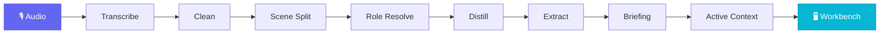

<div align="center">


**One audio file → a full day of structured context**

[](https://github.com/openmy-ai/openmy/releases)
[](LICENSE)
[](https://python.org)
[]()

[Quick Start](#-quick-start) · [中文](README.md)

</div>

---

## ⚡ Quick Start

```bash
git clone https://github.com/openmy-ai/openmy.git && cd openmy
python3 -m venv .venv && source .venv/bin/activate
pip install .
echo "GEMINI_API_KEY=your-key" > .env
openmy quick-start path/to/your-audio.wav
```

Your browser opens `http://127.0.0.1:8420` with your first daily briefing.

Missing FFmpeg / wrong Python / no API key? The CLI tells you exactly what to fix in one line — no tracebacks.

---

## 🧠 Beyond Transcription

Most tools stop at text. OpenMy keeps going:

- **Scene splitting** — breaks a full day into distinct conversation segments
- **Role resolution** — detects who you're talking to: AI, friends, merchants, yourself
- **Distilled summaries** — one to two sentences per scene
- **Structured extraction** — events, facts, and insights in separate buckets
- **Daily briefing** — auto-generated with summary, stats, and timeline
- **Active context** — cross-day accumulation of projects, todos, and people; untouched items flagged after 7 days

**OpenMy isn't a better transcription tool. It's what happens after transcription.**

---

## 🔬 How It Works



The cleaning stage is a pure rule engine — no API calls. All other stages use Gemini. Model and parameters are centralized in [`config.py`](src/openmy/config.py).

---

## 🖥️ Local Workbench

<div align="center">

</div>

Open `http://127.0.0.1:8420`: overview, briefing, summary timeline, scene table, charts, correction dictionary, pipeline re-run.

All data stays in a local `data/` directory. Server defaults to `127.0.0.1`. No SaaS, no accounts, no uploads.

---

## 🤖 For Agent Developers

OpenMy's CLI is built for AI agents, not humans:

```bash
openmy context --compact      # outputs Markdown, inject into system prompt
openmy agent --recent         # auto-read on agent boot
openmy correct merge-project "AI Thinking" "OpenMy"  # fix context errors
```

One command. Your agent knows what the user is working on, who they're talking to, and what's still pending.

---

## 📍 Roadmap

- ~~**v0.1**~~ ✅ Core pipeline running
- **v0.2** 🟢 Current — quick-start, web workbench, correction dictionary, structured extraction, active context
- **v0.3** 🔜 Multi-language, smarter cross-day context, Obsidian plugin
- **v1.0** 📋 Stable API, plugin system, multi-LLM backend

---

## 🧪 Development

```bash
pip install -e .
python3 -m pytest tests/ -v   # 167 tests, no API key needed
```

---

## 📂 Repository Structure

```
src/openmy/           CLI + 9 service modules
  services/
    ingest/            Audio import
    cleaning/          Text cleaning (rule engine)
    segmentation/      Scene splitting
    roles/             Role resolution
    distillation/      Summary distillation
    extraction/        Structured extraction
    briefing/          Daily briefing
    context/           Active context
    screen_recognition/  Screen context
app/                  Local web workbench
tests/                167 automated tests
```

---

[CONTRIBUTING](CONTRIBUTING.md) · [MIT License](LICENSE) · by [Joseph Zhou](https://github.com/openmy-ai)

<div align="center">

**If this is useful, a ⭐ means the world.**

</div>
