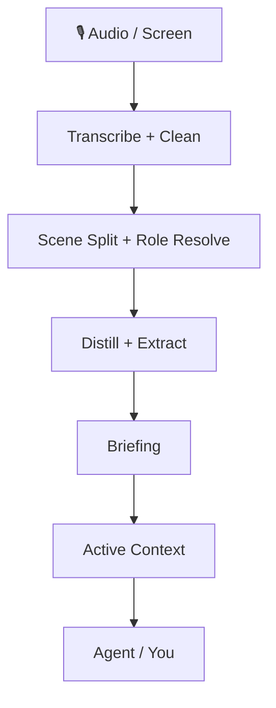

<div align="center">


# Turn audio and screen activity into context your agent can keep

OpenMy turns saved audio, screen context, and daily progress into **queryable, correctable, cross-day memory**. You can read the daily report yourself or plug the same state into your own agent.

[](https://github.com/openmy-ai/openmy/releases)
[](LICENSE)
[](https://python.org)
[]()

[中文](README.md)

</div>

---

## What you get first

- **A daily briefing** with summaries, timeline, tables, and charts
- **Active context** that keeps projects, people, todos, and facts across days
- **A correction loop** so names, roles, and decisions get better over time
- **Stable entrypoints** for both humans and agents

---

## Why this is not just another transcription tool

OpenMy does more than convert audio into text.

It keeps going:

1. Split a day into scenes
2. Resolve who you were talking to and what was happening
3. Generate a daily briefing plus structured output
4. Accumulate ongoing projects, people, and open loops into long-term context

That makes OpenMy a **personal context engine**, not a one-off transcript utility.

> OpenMy is not a live recording app. It processes recordings you already saved, plus optional screen context from the same day.

---

## ⚡ Get it running in one minute

```bash
git clone https://github.com/openmy-ai/openmy.git && cd openmy
python3 -m venv .venv && source .venv/bin/activate
pip install .
openmy quick-start --demo
```

> You only need Python 3.10+ and FFmpeg.
> `--demo` runs the bundled sample first so you can verify the full flow before switching to your own audio.

### After the demo works

```bash
openmy skill health.check --json
openmy quick-start path/to/your-audio.wav
```

- `health.check` gives you a recommended route first, so you do not have to guess between six engines
- `quick-start` now pauses and guides you if first-run setup is still incomplete

### How should you choose a speech-to-text engine?

Do not start by comparing every engine yourself. Use this order:

1. Run `health.check` and follow the recommended route
2. If your recordings are mostly Chinese and you want local-first, start with `funasr`
3. If you want the safest local path first, use `faster-whisper`
4. Only look at cloud options after that, or when local setup is not the right fit

Cloud options: `gemini`, `groq`, `dashscope`, and `deepgram` are there when you want them, but they are not the first thing you need to think about.

- `GEMINI_API_KEY` is **not** required for audio processing; it only affects later LLM-backed cleanup steps

---

## Who this is for

### 1. People who want a daily report from voice notes, meetings, and ideas
OpenMy helps turn raw recordings into a readable day summary instead of leaving you with a pile of files.

### 2. People already using agents heavily
OpenMy can act as a long-term context layer so your agent reads what happened instead of asking you to restate everything.

### 3. Developers building personal-context workflows
You can plug the stable actions into your own CLI, desktop tool, or automation flow.

---

## What the output looks like

<div align="center">

</div>

The generated report includes:

- **Overview** — scenes, word count, speaking time, role distribution
- **Daily briefing** — what happened and what still matters
- **Summary timeline** — condensed scene-by-scene timeline
- **Scene table** — full list of scenes with expandable detail
- **Charts** — visual breakdown by role and duration
- **Corrections** — fix names, roles, and decisions
- **Flow controls** — re-run specific stages when needed

---

## How it works



If you want the deeper system view, read [docs/architecture.md](docs/architecture.md).

---

## 🤖 Connect OpenMy to your agent

The core asset is not a single CLI shell. It is **durable context state plus a stable action contract**.

Current stable JSON entrypoints:

```bash
openmy skill status.get --json
openmy skill day.get --date 2026-04-08 --json
openmy skill context.get --json
openmy skill day.run --date 2026-04-08 --audio path/to/audio.wav --json
```

- `status.get` — inspect readiness and data presence
- `day.get` — read one processed day
- `context.get` — read cross-day active context
- `day.run` — process one day and persist artifacts

The old `openmy agent` entrypoint still exists as a compatibility alias.

### Install the skill bundle

#### One-shot install

```bash
bash scripts/install-skills.sh
```

The script detects common agent tools and links the OpenMy skill bundle for you.

#### Key directories if you want to wire it up manually

- `skills/openmy/`
- `skills/openmy-startup-context/`
- `skills/openmy-context-read/`
- `skills/openmy-context-query/`
- `skills/openmy-day-run/`
- `skills/openmy-day-view/`
- `skills/openmy-correction-apply/`
- `skills/openmy-status-review/`
- `skills/openmy-vocab-init/`
- `skills/openmy-profile-init/`

---

## Optional capabilities

### Screen recognition

OpenMy can enrich a day with screen context so the system knows what was on-screen while you were speaking.

This feature is optional. It now uses OpenMy's built-in capture loop, so there is no separate local service to install. If you leave it off, OpenMy falls back to voice-only mode and the main flow still works.

### Export

Daily briefings can be exported to:

- `Obsidian` — write Markdown directly into your vault
- `Notion` — create pages through the API

Export is optional. If it is not configured, the main pipeline still completes normally.

### Folder watcher mode

If you prefer dropping recordings into a folder and letting OpenMy process them automatically, run the watcher:

```bash
python3 -m openmy.services.watcher ~/Recordings/OpenMy
```

This works well when:
- your phone syncs recordings onto the computer
- a recorder or wireless mic writes into a fixed folder
- you want capture and processing to stay separate

The watcher waits for files to settle, then starts processing automatically. You can still ignore watcher mode and run `quick-start` or `day.run` manually.

### Recommended workflow

Record first, sync into a stable folder, run `openmy quick-start`, then enable watcher mode only after the manual path feels right.

---

## Roadmap

- ~~v0.1~~ ✅ Core pipeline working
- **v0.2 now** — quick-start, report workspace, correction dictionary, structured extraction, active context
- **v0.3** — multilingual support, stronger cross-day context, Obsidian plugin
- **v1.0** — stable API, plugin system, multiple model backends

---

## Development

```bash
pip install -e .
uvx ruff check .
python3 -m pytest tests/ -v
```

---

## Current technical implementation and architecture tree

```text
openmy/
├── README.md                          # Chinese landing page
├── README.en.md                       # English landing page
├── pyproject.toml                     # packaging, dependencies, CLI entrypoints
├── .github/                           # CI, templates, dependency update config
├── docs/
│   ├── architecture.md                # extra architecture notes
│   ├── images/                        # banner and report screenshots
│   ├── internal/                      # internal implementation notes
│   └── plans/                         # historical plans and design drafts
├── scripts/
│   └── install-skills.sh              # install skill bundle into common agent tools
├── skills/                            # agent-facing skill bundle
│   ├── openmy/                        # top-level router skill
│   ├── openmy-startup-context/        # load context on startup
│   ├── openmy-context-read/           # read-only context access
│   ├── openmy-context-query/          # structured context query
│   ├── openmy-day-run/                # run one processing day
│   ├── openmy-day-view/               # inspect one processed day
│   ├── openmy-correction-apply/       # write correction actions back
│   ├── openmy-status-review/          # inspect system state
│   ├── openmy-vocab-init/             # initialize vocabulary files
│   ├── openmy-profile-init/           # initialize user profile
│   ├── openmy-screen-recognition/     # screen recognition guidance
│   ├── openmy-distill/                # scene distillation guidance
│   ├── openmy-extract/                # structured extraction guidance
│   ├── openmy-export/                 # export guidance
│   └── openmy-aggregate/              # weekly and monthly aggregation guidance
├── app/                               # local report web app
│   ├── server.py                      # web server entrypoint
│   ├── payloads.py                    # payload assembly for the UI
│   ├── context_api.py                 # context read API
│   ├── pipeline_api.py                # rerun pipeline API
│   ├── job_runner.py                  # background task execution
│   ├── http_handlers.py               # route handlers
│   ├── http_responses.py              # response helpers
│   ├── index.html                     # page shell
│   └── static/                        # frontend scripts and static assets
├── src/openmy/                        # main program code
│   ├── __main__.py                    # module entrypoint
│   ├── cli.py                         # top-level CLI entrypoint
│   ├── config.py                      # environment variables and defaults
│   ├── skill_dispatch.py              # skill command dispatcher with JSON output
│   ├── commands/                      # command action layer
│   │   ├── run.py                     # quick-start, day.run, main pipeline
│   │   ├── context.py                 # context commands
│   │   └── correct.py                 # correction commands
│   ├── domain/                        # domain models and intent models
│   │   ├── models.py                  # core data structures
│   │   └── intent.py                  # intent-related models
│   ├── adapters/                      # external adaptation layer
│   │   ├── transcription/             # transcription adapters
│   │   │   └── gemini_cli.py          # Gemini CLI adapter
│   │   └── screen_recognition/
│   │       └── client.py              # screen recognition client adapter
│   ├── providers/                     # pluggable capability providers
│   │   ├── base.py                    # shared provider base class
│   │   ├── registry.py                # provider registry
│   │   ├── llm/
│   │   │   └── gemini.py              # LLM integration
│   │   ├── stt/
│   │   │   ├── faster_whisper.py      # local English-first transcription
│   │   │   ├── funasr.py              # local Chinese-first transcription
│   │   │   ├── gemini.py              # Gemini speech transcription
│   │   │   ├── groq_whisper.py        # Groq speech transcription
│   │   │   ├── dashscope_asr.py       # DashScope speech transcription
│   │   │   └── deepgram.py            # Deepgram speech transcription
│   │   └── export/
│   │       ├── obsidian.py            # export to Obsidian
│   │       └── notion.py              # export to Notion
│   ├── services/                      # pipeline and system services
│   │   ├── ingest/
│   │   │   ├── audio_pipeline.py      # audio read, chunk, transcribe pipeline
│   │   │   └── transcription_enrichment.py # transcript enrichment
│   │   ├── cleaning/
│   │   │   └── cleaner.py             # rule-based cleanup and dictionary application
│   │   ├── segmentation/
│   │   │   └── segmenter.py           # scene segmentation
│   │   ├── roles/
│   │   │   └── resolver.py            # scene role resolution
│   │   ├── distillation/
│   │   │   └── distiller.py           # scene summary generation
│   │   ├── extraction/
│   │   │   └── extractor.py           # day-level structured extraction
│   │   ├── briefing/
│   │   │   ├── generator.py           # daily briefing generation
│   │   │   └── cli.py                 # briefing CLI
│   │   ├── context/
│   │   │   ├── active_context.py      # active-context read/write
│   │   │   ├── consolidation.py       # cross-day merge and open-loop handling
│   │   │   ├── corrections.py         # correction writeback
│   │   │   └── renderer.py            # compact context rendering
│   │   ├── query/
│   │   │   ├── context_query.py       # context query entrypoint
│   │   │   └── search_index.py        # search index
│   │   ├── aggregation/
│   │   │   ├── weekly.py              # weekly aggregation
│   │   │   └── monthly.py             # monthly aggregation
│   │   ├── onboarding/
│   │   │   └── state.py               # first-run state tracking
│   │   ├── screen_recognition/
│   │   │   ├── capture.py             # screen capture pipeline
│   │   │   ├── provider.py            # screen capability entrypoint
│   │   │   ├── settings.py            # screen settings read/write
│   │   │   ├── align.py               # audio/screen alignment
│   │   │   ├── enrich.py              # inject screen context into extraction output
│   │   │   ├── hints.py               # project hints and clue extraction
│   │   │   ├── privacy.py             # privacy filtering
│   │   │   ├── sessionize.py          # screen session grouping
│   │   │   ├── summary.py             # screen summary generation
│   │   │   ├── frontmost_context.swift# foreground-window reader
│   │   │   └── apple_vision_ocr.swift # Apple Vision OCR helper
│   │   ├── scene_quality.py           # crosstalk and low-signal detection
│   │   └── watcher.py                 # folder watcher
│   ├── resources/                     # default vocabulary and correction resources
│   └── utils/
│       ├── io.py                      # file I/O helpers
│       └── time.py                    # time helpers
├── data/                              # local runtime output and state
│   ├── YYYY-MM-DD/                    # one-day result directories
│   ├── runtime/                       # screen settings, jobs, runtime state
│   ├── weekly/                        # weekly aggregates
│   ├── monthly/                       # monthly aggregates
│   ├── profile.json                   # user profile
│   ├── onboarding_state.json          # first-run progress
│   └── search_index.json              # cached search index
└── tests/
    ├── fixtures/                      # sample audio and scene fixtures
    ├── unit/                          # unit tests
    ├── test_weekly_aggregation.py     # weekly aggregation tests
    └── test_monthly_aggregation.py    # monthly aggregation tests
```

### Main processing chain

```text
quick-start / day.run
└── ingest — audio transcription
    └── cleaning — text cleanup
        └── segmentation — scene split
            └── roles — role resolution
                └── distillation — scene summaries
                    └── extraction — structured extraction
                        └── briefing — daily report generation
                            └── context — active-context update
                                └── export / app / skills — export, UI, agent access
```

For deeper supporting notes, see [docs/architecture.md](docs/architecture.md).

---

[CONTRIBUTING](CONTRIBUTING.md) · [CODE_OF_CONDUCT](CODE_OF_CONDUCT.md) · [SECURITY](SECURITY.md) · [MIT License](LICENSE)

If this is useful, a ⭐ helps a lot.
