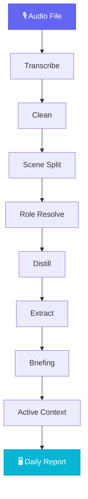

<div align="center">


**A personal context engine for many agents**

Turns raw personal signals such as audio and screen context into state that agents can query, correct, and accumulate across days. Gemini is the default recommended provider, but OpenMy is not defined by a single vendor.

[](https://github.com/openmy-ai/openmy/releases)
[](LICENSE)
[](https://python.org)
[]()

[中文](README.md)

</div>

---

## ⚡ Quick Start

```bash
git clone https://github.com/openmy-ai/openmy.git && cd openmy
python3 -m venv .venv && source .venv/bin/activate
pip install .
echo "GEMINI_API_KEY=your-key" > .env
openmy quick-start path/to/your-audio.wav
```

> Requirements: Python 3.10+, FFmpeg, and a usable provider key. The default path is still Gemini via `GEMINI_API_KEY`.

**First use: initialize your private vocabulary files**
```bash
cp src/openmy/resources/corrections.example.json src/openmy/resources/corrections.json
cp src/openmy/resources/vocab.example.txt src/openmy/resources/vocab.txt
```

These files are ignored by git so you can safely store personal typo fixes and proper nouns locally.

### Provider Config

- Default shortcut: `GEMINI_API_KEY`
- Provider-neutral keys:
  - `OPENMY_STT_PROVIDER`
  - `OPENMY_STT_MODEL`
  - `OPENMY_STT_API_KEY`
  - `OPENMY_LLM_PROVIDER`
  - `OPENMY_LLM_MODEL`
  - `OPENMY_LLM_API_KEY`
- Stage-specific overrides:
  - `OPENMY_EXTRACT_MODEL`
  - `OPENMY_DISTILL_MODEL`

---

## 🔬 Pipeline



### What Each Step Does

**Transcribe** — Converts audio into timestamped text.

**Clean** — Removes filler words, fixes punctuation, applies correction dictionary. Pure rules, no API calls.

**Scene Split** — Cuts a full day of text into distinct conversation segments based on time gaps and topic shifts.

**Role Resolve** — Identifies who you're talking to in each segment: AI assistant, friend, merchant, pet, or yourself. Uses screen context for better accuracy.

**Distill** — Compresses each scene into one or two sentences, preserving key information and role awareness.

**Extract** — Pulls three types of structured data from the full day:
- 🚀 **Events** — what happened, what's planned
- 📌 **Facts** — confirmed information, data, conclusions
- ⚡ **Insights** — ideas, judgments, inspirations

**Briefing** — Aggregates all scenes into a daily report with summary, timeline, and statistics.

**Active Context** — Accumulates projects, relationships, and todos across days. Items untouched for 7 days are automatically flagged stale.

---

## 🤖 Connect OpenMy To Your Agent

OpenMy's real asset is durable context state plus a stable action contract, not a single CLI shell.

Current stable JSON entrypoints:

```bash
openmy skill status.get --json
openmy skill day.get --date 2026-04-08 --json
openmy skill context.get --json
openmy skill day.run --date 2026-04-08 --audio path/to/audio.wav --json
```

The old `openmy agent` entrypoint still exists as a compatibility alias.

---

## 🖼️ Output

<div align="center">

</div>

The generated report includes 7 views:

- **Overview** — daily stats: scene count, word count, audio duration, role distribution
- **Briefing** — structured daily summary
- **Summary Timeline** — distilled results per scene in chronological order
- **Scene Table** — full scene list with expandable transcripts
- **Charts** — role distribution and scene duration visualizations
- **Corrections** — typo dictionary with global search & replace
- **Pipeline** — re-run any pipeline stage

---

## 📍 Roadmap

- ~~**v0.1**~~ ✅ Core pipeline running
- **v0.2** 🟢 Current — quick-start, report workbench, correction dictionary, structured extraction, active context
- **v0.3** 🔜 Multi-language, cross-day context improvements, Obsidian plugin
- **v1.0** 📋 Stable API, plugin system, multi-LLM backend

---

## 🧪 Development

```bash
pip install -e .
python3 -m pytest tests/ -v   # 167 tests, no API key needed
```

---

## 📂 Repository Structure

```
src/openmy/
  commands/          CLI / skill entrypoints
  providers/         STT / LLM provider boundary
  services/
    ingest/            Audio import & preprocessing
    cleaning/          Text cleaning (rule engine)
    segmentation/      Scene splitting
    roles/             Role resolution
    distillation/      Summary distillation
    extraction/        Structured extraction
    briefing/          Daily briefing
    context/           Active context
    screen_recognition/  Screen context
  adapters/
    transcription/    Legacy transcription compatibility shim
app/                  Report page
tests/                Automated tests
```

---

[CONTRIBUTING](CONTRIBUTING.md) · [MIT License](LICENSE) · by [Joseph Zhou](https://github.com/openmy-ai)

<div align="center">

**If this is useful, a ⭐ means the world.**

</div>
