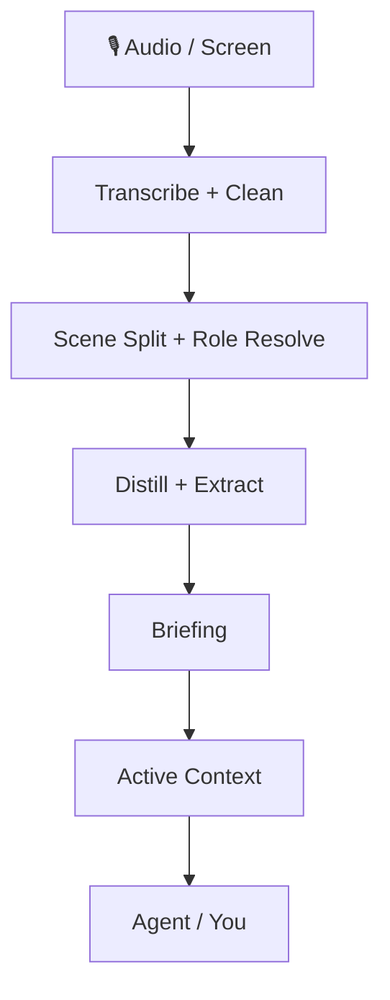

<div align="center">


# Transformez vos enregistrements et votre activité écran en contexte durable pour vos agents

OpenMy organise les fichiers audio déjà enregistrés, le contexte écran et la progression quotidienne en une **mémoire interrogeable, corrigeable et cumulée d’un jour à l’autre**. Vous pouvez lire le rapport vous-même ou brancher le même état sur votre agent.

[](https://github.com/openmy-ai/openmy/releases)
[](LICENSE)
[](https://python.org)
[]()

**Langues :** [中文](README.md) · [English](README.en.md) · [한국어](README.ko.md) · **Français** · [Italiano](README.it.md) · [日本語](README.ja.md)

</div>

---

## Ce que vous obtenez en premier

- **Un briefing quotidien** avec résumés, frise chronologique, tableaux et graphiques
- **Un contexte actif** qui conserve projets, personnes, tâches et faits sur plusieurs jours
- **Une boucle de correction** pour améliorer progressivement noms, rôles et décisions
- **Des points d’entrée stables** pour les humains comme pour les agents

---

## Pourquoi ce n’est pas un simple outil de transcription

OpenMy ne se contente pas de convertir l’audio en texte.

Le système continue ensuite :

1. il découpe la journée en scènes ;
2. il identifie avec qui vous parliez et ce qui se passait ;
3. il produit un briefing quotidien et une sortie structurée ;
4. il accumule projets en cours, personnes et éléments ouverts dans un contexte de long terme.

OpenMy est donc un **moteur de contexte personnel**, pas un utilitaire de transcription jetable.

> OpenMy n’est pas une application d’enregistrement en direct. Il traite les enregistrements déjà sauvegardés, avec en option le contexte écran du même jour.

---

## ⚡ Lancez-le en une minute

```bash
git clone https://github.com/openmy-ai/openmy.git && cd openmy
python3 -m venv .venv && source .venv/bin/activate
pip install .
openmy quick-start --demo
```

> Il vous faut seulement Python 3.10+ et FFmpeg.
> `--demo` exécute l’exemple intégré pour vérifier toute la chaîne avant de passer à vos propres fichiers.

### Après le démonstrateur

```bash
openmy skill health.check --json
openmy quick-start path/to/your-audio.wav
```

- `health.check` propose d’abord la route la plus adaptée à votre machine
- `quick-start` s’arrête et vous guide si la configuration initiale n’est pas encore terminée

### Comment choisir le moteur de parole vers texte

Ne commencez pas par comparer tous les moteurs à la main. Suivez cet ordre :

1. exécutez `health.check` et suivez la recommandation ;
2. si vos enregistrements sont surtout en chinois et que vous voulez une voie locale, commencez par `funasr` ;
3. si vous voulez d’abord la voie locale la plus sûre, utilisez `faster-whisper` ;
4. ne regardez les options en nuage que si la voie locale ne convient pas ou si vous voulez moins d’installation.

Les options en nuage `gemini`, `groq`, `dashscope` et `deepgram` sont disponibles, mais elles ne doivent pas être votre premier sujet de décision.

- `GEMINI_API_KEY` n’est **pas** requis pour le traitement audio ; il n’influence que les étapes tardives pilotées par grand modèle

---

## À qui cela s’adresse

### 1. Aux personnes qui veulent un rapport quotidien à partir de mémos vocaux, réunions et idées
OpenMy transforme une pile de fichiers bruts en résumé lisible de la journée.

### 2. Aux personnes qui utilisent déjà beaucoup des agents
OpenMy peut servir de couche de contexte durable pour que l’agent lise ce qui s’est passé au lieu de tout vous redemander.

### 3. Aux développeurs qui construisent des flux de contexte personnel
Vous pouvez brancher ces points d’entrée stables dans votre interface en ligne de commande, votre application de bureau ou vos automatisations.

---

## À quoi ressemble la sortie

<div align="center">

</div>

Le rapport généré comprend :

- **Overview** — nombre de scènes, volume de texte, temps de parole, répartition des rôles
- **Daily briefing** — ce qui s’est passé et ce qui reste important
- **Summary timeline** — frise condensée scène par scène
- **Scene table** — liste complète des scènes avec détail dépliable
- **Charts** — vue graphique par rôle et durée
- **Corrections** — correction des noms, rôles et décisions
- **Flow controls** — relance ciblée d’une étape

---

## Comment cela fonctionne



Pour une vue plus détaillée, lisez [docs/architecture.md](docs/architecture.md).

---

## 🤖 Connecter OpenMy à votre agent

L’actif principal n’est pas une simple interface en ligne de commande, mais **un état de contexte durable et un contrat d’actions stable**.

Points d’entrée JSON stables actuellement :

```bash
openmy skill status.get --json
openmy skill day.get --date 2026-04-08 --json
openmy skill context.get --json
openmy skill day.run --date 2026-04-08 --audio path/to/your-audio.wav --json
```

- `status.get` — vérifier l’état de préparation et la présence de données
- `day.get` — lire une journée déjà traitée
- `context.get` — lire le contexte actif sur plusieurs jours
- `day.run` — traiter une journée et enregistrer les artefacts

L’ancien point d’entrée `openmy agent` reste disponible comme alias de compatibilité.

### Installer le lot de compétences

#### Installation en une fois

```bash
bash scripts/install-skills.sh
```

Le script détecte les outils d’agent les plus courants et relie le lot de compétences OpenMy.

#### Répertoires clés pour un branchement manuel

- `skills/openmy/`
- `skills/openmy-startup-context/`
- `skills/openmy-context-read/`
- `skills/openmy-context-query/`
- `skills/openmy-day-run/`
- `skills/openmy-day-view/`
- `skills/openmy-correction-apply/`
- `skills/openmy-status-review/`
- `skills/openmy-vocab-init/`
- `skills/openmy-profile-init/`

---

## Capacités optionnelles

### Reconnaissance d’écran

OpenMy peut enrichir une journée avec le contexte écran pour savoir ce qui était affiché pendant que vous parliez.

Cette fonction est optionnelle. Elle utilise maintenant la boucle de capture intégrée d’OpenMy ; aucun service local séparé n’est nécessaire. Si vous la laissez désactivée, OpenMy revient au mode voix seule et le flux principal continue de fonctionner.

### Export

Les briefings quotidiens peuvent être exportés vers :

- `Obsidian` — écriture directe en Markdown dans votre coffre
- `Notion` — création de pages via l’interface

L’export reste optionnel. S’il n’est pas configuré, le flux principal se termine normalement.

### Mode de surveillance de dossier

Si vous préférez déposer les enregistrements dans un dossier et laisser OpenMy traiter automatiquement, lancez le mode de surveillance :

```bash
python3 -m openmy.services.watcher ~/Recordings/OpenMy
```

C’est particulièrement utile si :
- votre téléphone synchronise les enregistrements sur l’ordinateur ;
- un enregistreur ou un micro sans fil écrit dans un dossier fixe ;
- vous souhaitez séparer la collecte et le traitement.

Le mode de surveillance attend que les fichiers soient stabilisés puis lance le traitement. Vous pouvez aussi l’ignorer et utiliser `quick-start` ou `day.run` manuellement.

### Flux recommandé

En pratique, le plus simple est de d’abord enregistrer, ensuite synchroniser les fichiers dans un dossier stable, lancer `openmy quick-start`, puis activer le mode de surveillance seulement quand le chemin manuel vous convient.

---

## Feuille de route

- ~~v0.1~~ ✅ chaîne principale fonctionnelle
- **v0.2 now** — quick-start, report workspace, correction dictionary, structured extraction, active context
- **v0.3** — multilingual support, stronger cross-day context, Obsidian plugin
- **v1.0** — stable API, plugin system, multiple model backends

---

## Développement

```bash
pip install -e .
uvx ruff check .
python3 -m pytest tests/ -v
```

---

## Arbre actuel de l’implémentation technique et de l’architecture

## Current technical implementation and architecture tree

```text
openmy/
├── README.md                          # Chinese landing page
├── README.en.md                       # English landing page
├── pyproject.toml                     # packaging, dependencies, CLI entrypoints
├── .github/                           # CI, templates, dependency update config
├── docs/
│   ├── architecture.md                # extra architecture notes
│   ├── images/                        # banner and report screenshots
│   ├── internal/                      # internal implementation notes
│   └── plans/                         # historical plans and design drafts
├── scripts/
│   └── install-skills.sh              # install skill bundle into common agent tools
├── skills/                            # agent-facing skill bundle
│   ├── openmy/                        # top-level router skill
│   ├── openmy-startup-context/        # load context on startup
│   ├── openmy-context-read/           # read-only context access
│   ├── openmy-context-query/          # structured context query
│   ├── openmy-day-run/                # run one processing day
│   ├── openmy-day-view/               # inspect one processed day
│   ├── openmy-correction-apply/       # write correction actions back
│   ├── openmy-status-review/          # inspect system state
│   ├── openmy-vocab-init/             # initialize vocabulary files
│   ├── openmy-profile-init/           # initialize user profile
│   ├── openmy-screen-recognition/     # screen recognition guidance
│   ├── openmy-distill/                # scene distillation guidance
│   ├── openmy-extract/                # structured extraction guidance
│   ├── openmy-export/                 # export guidance
│   └── openmy-aggregate/              # weekly and monthly aggregation guidance
├── app/                               # local report web app
│   ├── server.py                      # web server entrypoint
│   ├── payloads.py                    # payload assembly for the UI
│   ├── context_api.py                 # context read API
│   ├── pipeline_api.py                # rerun pipeline API
│   ├── job_runner.py                  # background task execution
│   ├── http_handlers.py               # route handlers
│   ├── http_responses.py              # response helpers
│   ├── index.html                     # page shell
│   └── static/                        # frontend scripts and static assets
├── src/openmy/                        # main program code
│   ├── __main__.py                    # module entrypoint
│   ├── cli.py                         # top-level CLI entrypoint
│   ├── config.py                      # environment variables and defaults
│   ├── skill_dispatch.py              # skill command dispatcher with JSON output
│   ├── commands/                      # command action layer
│   │   ├── run.py                     # quick-start, day.run, main pipeline
│   │   ├── context.py                 # context commands
│   │   └── correct.py                 # correction commands
│   ├── domain/                        # domain models and intent models
│   │   ├── models.py                  # core data structures
│   │   └── intent.py                  # intent-related models
│   ├── adapters/                      # external adaptation layer
│   │   ├── transcription/             # transcription adapters
│   │   │   └── gemini_cli.py          # Gemini CLI adapter
│   │   └── screen_recognition/
│   │       └── client.py              # screen recognition client adapter
│   ├── providers/                     # pluggable capability providers
│   │   ├── base.py                    # shared provider base class
│   │   ├── registry.py                # provider registry
│   │   ├── llm/
│   │   │   └── gemini.py              # LLM integration
│   │   ├── stt/
│   │   │   ├── faster_whisper.py      # local English-first transcription
│   │   │   ├── funasr.py              # local Chinese-first transcription
│   │   │   ├── gemini.py              # Gemini speech transcription
│   │   │   ├── groq_whisper.py        # Groq speech transcription
│   │   │   ├── dashscope_asr.py       # DashScope speech transcription
│   │   │   └── deepgram.py            # Deepgram speech transcription
│   │   └── export/
│   │       ├── obsidian.py            # export to Obsidian
│   │       └── notion.py              # export to Notion
│   ├── services/                      # pipeline and system services
│   │   ├── ingest/
│   │   │   ├── audio_pipeline.py      # audio read, chunk, transcribe pipeline
│   │   │   └── transcription_enrichment.py # transcript enrichment
│   │   ├── cleaning/
│   │   │   └── cleaner.py             # rule-based cleanup and dictionary application
│   │   ├── segmentation/
│   │   │   └── segmenter.py           # scene segmentation
│   │   ├── roles/
│   │   │   └── resolver.py            # scene role resolution
│   │   ├── distillation/
│   │   │   └── distiller.py           # scene summary generation
│   │   ├── extraction/
│   │   │   └── extractor.py           # day-level structured extraction
│   │   ├── briefing/
│   │   │   ├── generator.py           # daily briefing generation
│   │   │   └── cli.py                 # briefing CLI
│   │   ├── context/
│   │   │   ├── active_context.py      # active-context read/write
│   │   │   ├── consolidation.py       # cross-day merge and open-loop handling
│   │   │   ├── corrections.py         # correction writeback
│   │   │   └── renderer.py            # compact context rendering
│   │   ├── query/
│   │   │   ├── context_query.py       # context query entrypoint
│   │   │   └── search_index.py        # search index
│   │   ├── aggregation/
│   │   │   ├── weekly.py              # weekly aggregation
│   │   │   └── monthly.py             # monthly aggregation
│   │   ├── onboarding/
│   │   │   └── state.py               # first-run state tracking
│   │   ├── screen_recognition/
│   │   │   ├── capture.py             # screen capture pipeline
│   │   │   ├── provider.py            # screen capability entrypoint
│   │   │   ├── settings.py            # screen settings read/write
│   │   │   ├── align.py               # audio/screen alignment
│   │   │   ├── enrich.py              # inject screen context into extraction output
│   │   │   ├── hints.py               # project hints and clue extraction
│   │   │   ├── privacy.py             # privacy filtering
│   │   │   ├── sessionize.py          # screen session grouping
│   │   │   ├── summary.py             # screen summary generation
│   │   │   ├── frontmost_context.swift# foreground-window reader
│   │   │   └── apple_vision_ocr.swift # Apple Vision OCR helper
│   │   ├── scene_quality.py           # crosstalk and low-signal detection
│   │   └── watcher.py                 # folder watcher
│   ├── resources/                     # default vocabulary and correction resources
│   └── utils/
│       ├── io.py                      # file I/O helpers
│       └── time.py                    # time helpers
├── data/                              # local runtime output and state
│   ├── YYYY-MM-DD/                    # one-day result directories
│   ├── runtime/                       # screen settings, jobs, runtime state
│   ├── weekly/                        # weekly aggregates
│   ├── monthly/                       # monthly aggregates
│   ├── profile.json                   # user profile
│   ├── onboarding_state.json          # first-run progress
│   └── search_index.json              # cached search index
└── tests/
    ├── fixtures/                      # sample audio and scene fixtures
    ├── unit/                          # unit tests
    ├── test_weekly_aggregation.py     # weekly aggregation tests
    └── test_monthly_aggregation.py    # monthly aggregation tests
```

### Main processing chain

```text
quick-start / day.run
└── ingest — audio transcription
    └── cleaning — text cleanup
        └── segmentation — scene split
            └── roles — role resolution
                └── distillation — scene summaries
                    └── extraction — structured extraction
                        └── briefing — daily report generation
                            └── context — active-context update
                                └── export / app / skills — export, UI, agent access
```

For deeper supporting notes, see [docs/architecture.md](docs/architecture.md).

---

[CONTRIBUTING](CONTRIBUTING.md) · [CODE_OF_CONDUCT](CODE_OF_CONDUCT.md) · [SECURITY](SECURITY.md) · [MIT License](LICENSE)

If this is useful, a ⭐ helps a lot.
