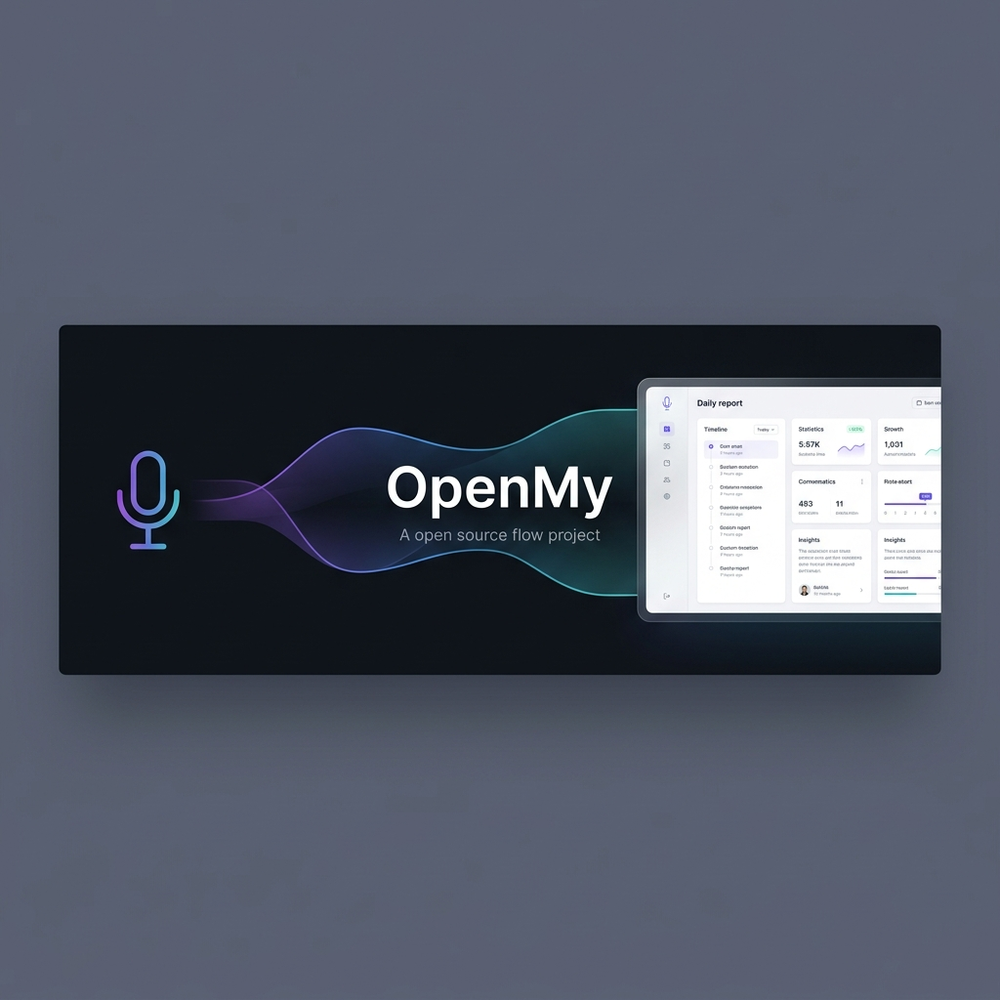
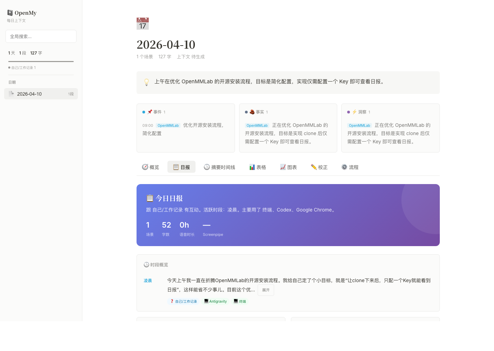
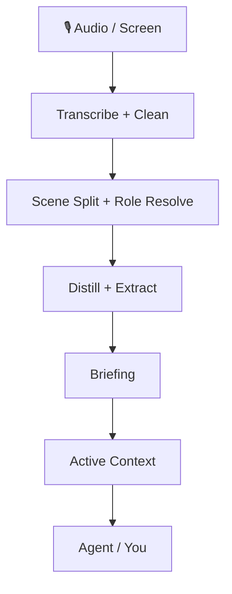

<div align="center">



# Trasforma registrazioni e attività sullo schermo in contesto duraturo per i tuoi agenti

OpenMy organizza audio già salvato, contesto dello schermo e avanzamento quotidiano in una **memoria interrogabile, correggibile e cumulativa tra più giorni**. Puoi leggere il rapporto giornaliero da solo oppure collegare lo stesso stato al tuo agente.

[](https://github.com/openmy-ai/openmy/releases)
[](LICENSE)
[](https://python.org)
[]()

[中文](README.md) · [English](README.en.md) · [한국어](README.ko.md) · [Français](README.fr.md) · [Italiano](README.it.md) · [日本語](README.ja.md)

</div>

---

## Cosa ottieni subito

- **Un briefing giornaliero** con riassunti, linea temporale, tabelle e grafici
- **Contesto attivo** che conserva progetti, persone, attività e fatti tra più giorni
- **Un ciclo di correzione** che migliora nomi, ruoli e decisioni nel tempo
- **Punti di ingresso stabili** sia per le persone sia per gli agenti

---

## Perché non è solo un altro strumento di trascrizione

OpenMy non si limita a trasformare l’audio in testo.

Poi continua a fare questo:

1. divide la giornata in scene;
2. ricostruisce con chi stavi parlando e che cosa stava succedendo;
3. genera un briefing giornaliero e un’uscita strutturata;
4. accumula progetti in corso, persone ed elementi aperti in un contesto di lungo periodo.

Per questo OpenMy è un **motore di contesto personale**, non un semplice strumento usa e getta per trascrivere.

> OpenMy non è un’app di registrazione dal vivo. Elabora registrazioni già salvate, con contesto schermo opzionale della stessa giornata.

---

## ⚡ Avvialo in un minuto

```bash
git clone https://github.com/openmy-ai/openmy.git && cd openmy
python3 -m venv .venv && source .venv/bin/activate
pip install .
openmy quick-start --demo
```

> Ti servono solo Python 3.10+ e FFmpeg.
> `--demo` esegue prima l’esempio incluso, così puoi verificare l’intero flusso prima di passare ai tuoi file audio.

### Dopo il dimostratore

```bash
openmy skill health.check --json
openmy quick-start path/to/your-audio.wav
```

- `health.check` ti propone subito il percorso più adatto alla macchina
- `quick-start` si ferma e ti guida se la configurazione iniziale non è ancora completa

### Come scegliere il motore speech-to-text

Non partire confrontando a mano tutti i motori. L’ordine più sicuro è questo:

1. esegui `health.check` e segui la raccomandazione;
2. se le tue registrazioni sono soprattutto in cinese e vuoi una soluzione locale, parti da `funasr`;
3. se vuoi prima il percorso locale più stabile, usa `faster-whisper`;
4. guarda le opzioni in cloud solo se il percorso locale non ti va bene o se vuoi meno configurazione.

Le opzioni in cloud `gemini`, `groq`, `dashscope` e `deepgram` sono disponibili, ma non devono essere la tua prima preoccupazione.

- `GEMINI_API_KEY` **non** è richiesto per l’elaborazione audio; influisce solo sui passaggi finali basati su grandi modelli

---

## Per chi è pensato

### 1. Per chi vuole un rapporto giornaliero da note vocali, riunioni e idee
OpenMy trasforma pile di file grezzi in un riepilogo della giornata leggibile.

### 2. Per chi usa già molto gli agenti
OpenMy può diventare uno strato di contesto di lungo periodo, così l’agente legge ciò che è successo invece di chiedertelo di nuovo.

### 3. Per gli sviluppatori che costruiscono flussi di contesto personale
Puoi collegare questi punti di ingresso stabili alla tua riga di comando, alla tua app desktop o ai tuoi automatismi.

---

## Come appare l’output

<div align="center">

</div>

Il rapporto generato include:

- **Overview** — numero di scene, quantità di testo, tempo di parola, distribuzione dei ruoli
- **Daily briefing** — che cosa è successo e che cosa conta ancora
- **Summary timeline** — linea temporale compatta scena per scena
- **Scene table** — elenco completo delle scene con dettagli espandibili
- **Charts** — vista grafica per ruoli e durata
- **Corrections** — correzione di nomi, ruoli e decisioni
- **Flow controls** — rilancio mirato di una fase

---

## Come funziona



Per una vista più approfondita, leggi [docs/architecture.md](docs/architecture.md).

---

## 🤖 Collegare OpenMy al tuo agente

L’asset principale non è una singola interfaccia a riga di comando, ma **uno stato di contesto persistente e un contratto di azioni stabile**.

Punti di ingresso JSON stabili al momento:

```bash
openmy skill status.get --json
openmy skill day.get --date 2026-04-08 --json
openmy skill context.get --json
openmy skill day.run --date 2026-04-08 --audio path/to/your-audio.wav --json
```

- `status.get` — controlla stato di prontezza e presenza dei dati
- `day.get` — legge una giornata già elaborata
- `context.get` — legge il contesto attivo su più giorni
- `day.run` — elabora una giornata e salva gli artefatti

Il vecchio ingresso `openmy agent` resta disponibile come alias di compatibilità.

### Installare il pacchetto di skill

#### Installazione in un colpo solo

```bash
bash scripts/install-skills.sh
```

Lo script rileva gli strumenti di agente più comuni e collega il pacchetto di skill di OpenMy.

#### Directory chiave se vuoi collegarlo a mano

- `skills/openmy/`
- `skills/openmy-startup-context/`
- `skills/openmy-context-read/`
- `skills/openmy-context-query/`
- `skills/openmy-day-run/`
- `skills/openmy-day-view/`
- `skills/openmy-correction-apply/`
- `skills/openmy-status-review/`
- `skills/openmy-vocab-init/`
- `skills/openmy-profile-init/`

---

## Funzionalità opzionali

### Riconoscimento dello schermo

OpenMy può arricchire una giornata con il contesto dello schermo, così il sistema sa che cosa era visibile mentre parlavi.

Questa funzione è opzionale. Ora usa il ciclo di cattura integrato di OpenMy, quindi non serve installare un servizio locale separato. Se la lasci spenta, OpenMy torna alla modalità solo voce e il flusso principale continua a funzionare.

### Esportazione

I briefing giornalieri possono essere esportati in:

- `Obsidian` — scrittura diretta in Markdown nel tuo archivio
- `Notion` — creazione di pagine tramite interfaccia

L’esportazione è opzionale. Se non è configurata, il flusso principale termina comunque senza problemi.

### Modalità watcher della cartella

Se preferisci lasciare i file audio in una cartella e far elaborare tutto automaticamente da OpenMy, avvia il watcher:

```bash
python3 -m openmy.services.watcher ~/Recordings/OpenMy
```

Funziona bene quando:
- il telefono sincronizza le registrazioni sul computer;
- un registratore o un microfono wireless scrive in una cartella fissa;
- vuoi separare raccolta ed elaborazione.

Il watcher aspetta che i file siano stabili e poi avvia l’elaborazione. Se non ti serve, puoi ignorarlo e usare `quick-start` o `day.run` manualmente.

### Flusso consigliato

Il percorso più lineare è questo: registra prima, sincronizza in una cartella stabile, esegui `openmy quick-start`, poi abilita il watcher solo quando il percorso manuale ti convince.

---

## Roadmap

- ~~v0.1~~ ✅ pipeline principale funzionante
- **v0.2 now** — quick-start, report workspace, correction dictionary, structured extraction, active context
- **v0.3** — multilingual support, stronger cross-day context, Obsidian plugin
- **v1.0** — stable API, plugin system, multiple model backends

---

## Sviluppo

```bash
pip install -e .
uvx ruff check .
python3 -m pytest tests/ -v
```

---

## Albero attuale dell’implementazione tecnica e dell’architettura

## Current technical implementation and architecture tree

```text
openmy/
├── README.md                          # Chinese landing page
├── README.en.md                       # English landing page
├── pyproject.toml                     # packaging, dependencies, CLI entrypoints
├── .github/                           # CI, templates, dependency update config
├── docs/
│   ├── architecture.md                # extra architecture notes
│   ├── images/                        # banner and report screenshots
│   ├── internal/                      # internal implementation notes
│   └── plans/                         # historical plans and design drafts
├── scripts/
│   └── install-skills.sh              # install skill bundle into common agent tools
├── skills/                            # agent-facing skill bundle
│   ├── openmy/                        # top-level router skill
│   ├── openmy-startup-context/        # load context on startup
│   ├── openmy-context-read/           # read-only context access
│   ├── openmy-context-query/          # structured context query
│   ├── openmy-day-run/                # run one processing day
│   ├── openmy-day-view/               # inspect one processed day
│   ├── openmy-correction-apply/       # write correction actions back
│   ├── openmy-status-review/          # inspect system state
│   ├── openmy-vocab-init/             # initialize vocabulary files
│   ├── openmy-profile-init/           # initialize user profile
│   ├── openmy-screen-recognition/     # screen recognition guidance
│   ├── openmy-distill/                # scene distillation guidance
│   ├── openmy-extract/                # structured extraction guidance
│   ├── openmy-export/                 # export guidance
│   └── openmy-aggregate/              # weekly and monthly aggregation guidance
├── app/                               # local report web app
│   ├── server.py                      # web server entrypoint
│   ├── payloads.py                    # payload assembly for the UI
│   ├── context_api.py                 # context read API
│   ├── pipeline_api.py                # rerun pipeline API
│   ├── job_runner.py                  # background task execution
│   ├── http_handlers.py               # route handlers
│   ├── http_responses.py              # response helpers
│   ├── index.html                     # page shell
│   └── static/                        # frontend scripts and static assets
├── src/openmy/                        # main program code
│   ├── __main__.py                    # module entrypoint
│   ├── cli.py                         # top-level CLI entrypoint
│   ├── config.py                      # environment variables and defaults
│   ├── skill_dispatch.py              # skill command dispatcher with JSON output
│   ├── commands/                      # command action layer
│   │   ├── run.py                     # quick-start, day.run, main pipeline
│   │   ├── context.py                 # context commands
│   │   └── correct.py                 # correction commands
│   ├── domain/                        # domain models and intent models
│   │   ├── models.py                  # core data structures
│   │   └── intent.py                  # intent-related models
│   ├── adapters/                      # external adaptation layer
│   │   ├── transcription/             # transcription adapters
│   │   │   └── gemini_cli.py          # Gemini CLI adapter
│   │   └── screen_recognition/
│   │       └── client.py              # screen recognition client adapter
│   ├── providers/                     # pluggable capability providers
│   │   ├── base.py                    # shared provider base class
│   │   ├── registry.py                # provider registry
│   │   ├── llm/
│   │   │   └── gemini.py              # LLM integration
│   │   ├── stt/
│   │   │   ├── faster_whisper.py      # local English-first transcription
│   │   │   ├── funasr.py              # local Chinese-first transcription
│   │   │   ├── gemini.py              # Gemini speech transcription
│   │   │   ├── groq_whisper.py        # Groq speech transcription
│   │   │   ├── dashscope_asr.py       # DashScope speech transcription
│   │   │   └── deepgram.py            # Deepgram speech transcription
│   │   └── export/
│   │       ├── obsidian.py            # export to Obsidian
│   │       └── notion.py              # export to Notion
│   ├── services/                      # pipeline and system services
│   │   ├── ingest/
│   │   │   ├── audio_pipeline.py      # audio read, chunk, transcribe pipeline
│   │   │   └── transcription_enrichment.py # transcript enrichment
│   │   ├── cleaning/
│   │   │   └── cleaner.py             # rule-based cleanup and dictionary application
│   │   ├── segmentation/
│   │   │   └── segmenter.py           # scene segmentation
│   │   ├── roles/
│   │   │   └── resolver.py            # scene role resolution
│   │   ├── distillation/
│   │   │   └── distiller.py           # scene summary generation
│   │   ├── extraction/
│   │   │   └── extractor.py           # day-level structured extraction
│   │   ├── briefing/
│   │   │   ├── generator.py           # daily briefing generation
│   │   │   └── cli.py                 # briefing CLI
│   │   ├── context/
│   │   │   ├── active_context.py      # active-context read/write
│   │   │   ├── consolidation.py       # cross-day merge and open-loop handling
│   │   │   ├── corrections.py         # correction writeback
│   │   │   └── renderer.py            # compact context rendering
│   │   ├── query/
│   │   │   ├── context_query.py       # context query entrypoint
│   │   │   └── search_index.py        # search index
│   │   ├── aggregation/
│   │   │   ├── weekly.py              # weekly aggregation
│   │   │   └── monthly.py             # monthly aggregation
│   │   ├── onboarding/
│   │   │   └── state.py               # first-run state tracking
│   │   ├── screen_recognition/
│   │   │   ├── capture.py             # screen capture pipeline
│   │   │   ├── provider.py            # screen capability entrypoint
│   │   │   ├── settings.py            # screen settings read/write
│   │   │   ├── align.py               # audio/screen alignment
│   │   │   ├── enrich.py              # inject screen context into extraction output
│   │   │   ├── hints.py               # project hints and clue extraction
│   │   │   ├── privacy.py             # privacy filtering
│   │   │   ├── sessionize.py          # screen session grouping
│   │   │   ├── summary.py             # screen summary generation
│   │   │   ├── frontmost_context.swift# foreground-window reader
│   │   │   └── apple_vision_ocr.swift # Apple Vision OCR helper
│   │   ├── scene_quality.py           # crosstalk and low-signal detection
│   │   └── watcher.py                 # folder watcher
│   ├── resources/                     # default vocabulary and correction resources
│   └── utils/
│       ├── io.py                      # file I/O helpers
│       └── time.py                    # time helpers
├── data/                              # local runtime output and state
│   ├── YYYY-MM-DD/                    # one-day result directories
│   ├── runtime/                       # screen settings, jobs, runtime state
│   ├── weekly/                        # weekly aggregates
│   ├── monthly/                       # monthly aggregates
│   ├── profile.json                   # user profile
│   ├── onboarding_state.json          # first-run progress
│   └── search_index.json              # cached search index
└── tests/
    ├── fixtures/                      # sample audio and scene fixtures
    ├── unit/                          # unit tests
    ├── test_weekly_aggregation.py     # weekly aggregation tests
    └── test_monthly_aggregation.py    # monthly aggregation tests
```

### Main processing chain

```text
quick-start / day.run
└── ingest — audio transcription
    └── cleaning — text cleanup
        └── segmentation — scene split
            └── roles — role resolution
                └── distillation — scene summaries
                    └── extraction — structured extraction
                        └── briefing — daily report generation
                            └── context — active-context update
                                └── export / app / skills — export, UI, agent access
```

For deeper supporting notes, see [docs/architecture.md](docs/architecture.md).

---

[CONTRIBUTING](CONTRIBUTING.md) · [CODE_OF_CONDUCT](CODE_OF_CONDUCT.md) · [SECURITY](SECURITY.md) · [MIT License](LICENSE)

If this is useful, a ⭐ helps a lot.
