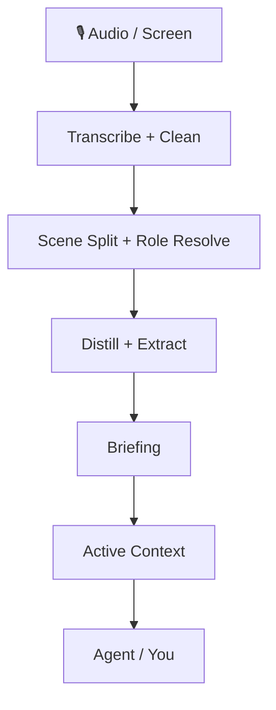

<div align="center">


# 録音と画面の動きを、エージェントが長く覚えておける個人コンテキストに変える

OpenMy は、保存済みの音声、画面コンテキスト、日々の進行状況を **検索できて、修正できて、日をまたいで蓄積できる記憶** として整理します。自分で日報を読むこともでき、同じ状態をそのまま自分のエージェントに接続することもできます。

[](https://github.com/openmy-ai/openmy/releases)
[](LICENSE)
[](https://python.org)
[]()

[中文](README.md) · [English](README.en.md) · [한국어](README.ko.md) · [Français](README.fr.md) · [Italiano](README.it.md) · [日本語](README.ja.md)

</div>

---

## 最初に手に入るもの

- **日次ブリーフィング**：要約、タイムライン、表、グラフをまとめた一日レポート
- **アクティブコンテキスト**：プロジェクト、人、タスク、事実を日をまたいで保持
- **修正ループ**：名前、役割、判断を直すたびに精度が上がる
- **安定した入口**：人にもエージェントにも同じ状態を渡せる

---

## なぜ単なる文字起こしツールではないのか

OpenMy は音声を文字に変えるだけでは終わりません。

その先で次の処理を続けます。

1. 一日をシーン単位に分割する
2. 誰と話していたのか、何が起きていたのかを整理する
3. 日次ブリーフィングと構造化された結果を作る
4. 進行中のプロジェクト、人、未解決項目を長期コンテキストに積み上げる

そのため OpenMy は **個人コンテキストエンジン** であり、一回きりの文字起こし道具ではありません。

> OpenMy はライブ録音アプリではありません。すでに保存された録音と、その日の任意の画面コンテキストを処理します。

---

## ⚡ 1 分で動かす

```bash
git clone https://github.com/openmy-ai/openmy.git && cd openmy
python3 -m venv .venv && source .venv/bin/activate
pip install .
openmy quick-start --demo
```

> 必要なのは Python 3.10+ と FFmpeg だけです。
> `--demo` では同梱サンプルを先に流し、手元の音声へ切り替える前に全体の流れを確認できます。

### デモのあとにやること

```bash
openmy skill health.check --json
openmy quick-start path/to/your-audio.wav
```

- `health.check`：この環境に合った推奨ルートを先に出します
- `quick-start`：初回設定が終わっていなければ止まって次の一手を案内します

### 音声認識エンジンの選び方

最初からすべてのエンジンを自分で比較する必要はありません。次の順が安全です。

1. `health.check` を実行して推奨ルートに従う
2. 録音が主に中国語系でローカル優先なら `funasr` から始める
3. まず確実なローカル経路を取りたいなら `faster-whisper` を使う
4. ローカル経路が合わないとき、または設定を減らしたいときだけクラウド経路を見る

`gemini`、`groq`、`dashscope`、`deepgram` といったクラウド経路は用意されていますが、最初に悩む必要はありません。

- `GEMINI_API_KEY` は音声処理の前提条件 **ではありません**。影響するのは後段の大規模モデル処理だけです

---

## こんな人に向いています

### 1. 音声メモ、会議、アイデアから日報を作りたい人
OpenMy は、生の録音ファイルの山を、その日の流れが読める要約へ変えます。

### 2. すでにエージェントを多用している人
毎回説明し直さなくても、エージェントが実際に起きたことを読める長期コンテキスト層として使えます。

### 3. 個人コンテキストの作業フローを作る開発者
安定した入口を、自分のコマンドライン、デスクトップツール、自動化フローに接続できます。

---

## 出力はこう見える

<div align="center">

</div>

生成されるレポートには次が含まれます。

- **Overview** — シーン数、文字量、発話時間、役割分布
- **Daily briefing** — 何が起きたか、何がまだ重要か
- **Summary timeline** — シーンごとの要約タイムライン
- **Scene table** — 展開して詳細を見られる全シーン一覧
- **Charts** — 役割と長さを可視化したグラフ
- **Corrections** — 名前、役割、判断の修正導線
- **Flow controls** — 特定段階の再実行導線

---

## どう動くのか



より詳しいシステム説明は [docs/architecture.md](docs/architecture.md) を見てください。

---

## 🤖 OpenMy を自分のエージェントにつなぐ

中心にあるのは単一のコマンドライン殻ではなく、**持続するコンテキスト状態と安定した動作契約** です。

現在の安定した JSON 入口は次のとおりです。

```bash
openmy skill status.get --json
openmy skill day.get --date 2026-04-08 --json
openmy skill context.get --json
openmy skill day.run --date 2026-04-08 --audio path/to/your-audio.wav --json
```

- `status.get` — 準備状態とデータ有無の確認
- `day.get` — 処理済みの一日を読む
- `context.get` — 日をまたぐアクティブコンテキストを読む
- `day.run` — 一日分を処理して成果物を保存する

古い `openmy agent` 入口も互換用エイリアスとして残っています。

### スキル束の導入

#### 一括導入

```bash
bash scripts/install-skills.sh
```

このスクリプトはよく使われるエージェント系ツールを検出し、OpenMy のスキル束を接続します。

#### 手動でつなぐときに重要なディレクトリ

- `skills/openmy/`
- `skills/openmy-startup-context/`
- `skills/openmy-context-read/`
- `skills/openmy-context-query/`
- `skills/openmy-day-run/`
- `skills/openmy-day-view/`
- `skills/openmy-correction-apply/`
- `skills/openmy-status-review/`
- `skills/openmy-vocab-init/`
- `skills/openmy-profile-init/`

---

## 任意機能

### 画面認識

OpenMy は画面コンテキストをその日の結果へ取り込み、話していた瞬間に画面で何が表示されていたかも残せます。

この機能は任意です。現在は OpenMy 内蔵のキャプチャ経路を使うため、別のローカルサービスを追加で入れる必要はありません。オフにしても音声だけの処理へ戻るだけで、主経路はそのまま動きます。

### 書き出し

日次ブリーフィングは次へ書き出せます。

- `Obsidian` — 保管庫へ Markdown を直接書き込む
- `Notion` — インターフェース経由でページを作成する

書き出しは任意です。設定していなくても主処理は最後まで完了します。

### フォルダ監視モード

録音ファイルをフォルダへ置くだけで OpenMy に自動処理させたいなら、監視モードを起動します。

```bash
python3 -m openmy.services.watcher ~/Recordings/OpenMy
```

次のような場合に向いています。
- 電話が録音をコンピュータへ同期する
- レコーダーや無線マイクが固定フォルダへ書き込む
- 収集と処理を分けたい

監視モードはファイルが安定したあとで自動処理を始めます。使わない場合は `quick-start` や `day.run` を手で実行してもかまいません。

### 推奨ワークフロー

まず録音し、安定したフォルダへ同期し、`openmy quick-start` で確認し、手動経路に納得したらそのあとで監視モードを有効にする、という順がいちばん無理がありません。

---

## ロードマップ

- ~~v0.1~~ ✅ 基本パイプライン完了
- **v0.2 now** — quick-start, report workspace, correction dictionary, structured extraction, active context
- **v0.3** — multilingual support, stronger cross-day context, Obsidian plugin
- **v1.0** — stable API, plugin system, multiple model backends

---

## 開発

```bash
pip install -e .
uvx ruff check .
python3 -m pytest tests/ -v
```

---

## 現在の技術実装とアーキテクチャツリー

## Current technical implementation and architecture tree

```text
openmy/
├── README.md                          # Chinese landing page
├── README.en.md                       # English landing page
├── pyproject.toml                     # packaging, dependencies, CLI entrypoints
├── .github/                           # CI, templates, dependency update config
├── docs/
│   ├── architecture.md                # extra architecture notes
│   ├── images/                        # banner and report screenshots
│   ├── internal/                      # internal implementation notes
│   └── plans/                         # historical plans and design drafts
├── scripts/
│   └── install-skills.sh              # install skill bundle into common agent tools
├── skills/                            # agent-facing skill bundle
│   ├── openmy/                        # top-level router skill
│   ├── openmy-startup-context/        # load context on startup
│   ├── openmy-context-read/           # read-only context access
│   ├── openmy-context-query/          # structured context query
│   ├── openmy-day-run/                # run one processing day
│   ├── openmy-day-view/               # inspect one processed day
│   ├── openmy-correction-apply/       # write correction actions back
│   ├── openmy-status-review/          # inspect system state
│   ├── openmy-vocab-init/             # initialize vocabulary files
│   ├── openmy-profile-init/           # initialize user profile
│   ├── openmy-screen-recognition/     # screen recognition guidance
│   ├── openmy-distill/                # scene distillation guidance
│   ├── openmy-extract/                # structured extraction guidance
│   ├── openmy-export/                 # export guidance
│   └── openmy-aggregate/              # weekly and monthly aggregation guidance
├── app/                               # local report web app
│   ├── server.py                      # web server entrypoint
│   ├── payloads.py                    # payload assembly for the UI
│   ├── context_api.py                 # context read API
│   ├── pipeline_api.py                # rerun pipeline API
│   ├── job_runner.py                  # background task execution
│   ├── http_handlers.py               # route handlers
│   ├── http_responses.py              # response helpers
│   ├── index.html                     # page shell
│   └── static/                        # frontend scripts and static assets
├── src/openmy/                        # main program code
│   ├── __main__.py                    # module entrypoint
│   ├── cli.py                         # top-level CLI entrypoint
│   ├── config.py                      # environment variables and defaults
│   ├── skill_dispatch.py              # skill command dispatcher with JSON output
│   ├── commands/                      # command action layer
│   │   ├── run.py                     # quick-start, day.run, main pipeline
│   │   ├── context.py                 # context commands
│   │   └── correct.py                 # correction commands
│   ├── domain/                        # domain models and intent models
│   │   ├── models.py                  # core data structures
│   │   └── intent.py                  # intent-related models
│   ├── adapters/                      # external adaptation layer
│   │   ├── transcription/             # transcription adapters
│   │   │   └── gemini_cli.py          # Gemini CLI adapter
│   │   └── screen_recognition/
│   │       └── client.py              # screen recognition client adapter
│   ├── providers/                     # pluggable capability providers
│   │   ├── base.py                    # shared provider base class
│   │   ├── registry.py                # provider registry
│   │   ├── llm/
│   │   │   └── gemini.py              # LLM integration
│   │   ├── stt/
│   │   │   ├── faster_whisper.py      # local English-first transcription
│   │   │   ├── funasr.py              # local Chinese-first transcription
│   │   │   ├── gemini.py              # Gemini speech transcription
│   │   │   ├── groq_whisper.py        # Groq speech transcription
│   │   │   ├── dashscope_asr.py       # DashScope speech transcription
│   │   │   └── deepgram.py            # Deepgram speech transcription
│   │   └── export/
│   │       ├── obsidian.py            # export to Obsidian
│   │       └── notion.py              # export to Notion
│   ├── services/                      # pipeline and system services
│   │   ├── ingest/
│   │   │   ├── audio_pipeline.py      # audio read, chunk, transcribe pipeline
│   │   │   └── transcription_enrichment.py # transcript enrichment
│   │   ├── cleaning/
│   │   │   └── cleaner.py             # rule-based cleanup and dictionary application
│   │   ├── segmentation/
│   │   │   └── segmenter.py           # scene segmentation
│   │   ├── roles/
│   │   │   └── resolver.py            # scene role resolution
│   │   ├── distillation/
│   │   │   └── distiller.py           # scene summary generation
│   │   ├── extraction/
│   │   │   └── extractor.py           # day-level structured extraction
│   │   ├── briefing/
│   │   │   ├── generator.py           # daily briefing generation
│   │   │   └── cli.py                 # briefing CLI
│   │   ├── context/
│   │   │   ├── active_context.py      # active-context read/write
│   │   │   ├── consolidation.py       # cross-day merge and open-loop handling
│   │   │   ├── corrections.py         # correction writeback
│   │   │   └── renderer.py            # compact context rendering
│   │   ├── query/
│   │   │   ├── context_query.py       # context query entrypoint
│   │   │   └── search_index.py        # search index
│   │   ├── aggregation/
│   │   │   ├── weekly.py              # weekly aggregation
│   │   │   └── monthly.py             # monthly aggregation
│   │   ├── onboarding/
│   │   │   └── state.py               # first-run state tracking
│   │   ├── screen_recognition/
│   │   │   ├── capture.py             # screen capture pipeline
│   │   │   ├── provider.py            # screen capability entrypoint
│   │   │   ├── settings.py            # screen settings read/write
│   │   │   ├── align.py               # audio/screen alignment
│   │   │   ├── enrich.py              # inject screen context into extraction output
│   │   │   ├── hints.py               # project hints and clue extraction
│   │   │   ├── privacy.py             # privacy filtering
│   │   │   ├── sessionize.py          # screen session grouping
│   │   │   ├── summary.py             # screen summary generation
│   │   │   ├── frontmost_context.swift# foreground-window reader
│   │   │   └── apple_vision_ocr.swift # Apple Vision OCR helper
│   │   ├── scene_quality.py           # crosstalk and low-signal detection
│   │   └── watcher.py                 # folder watcher
│   ├── resources/                     # default vocabulary and correction resources
│   └── utils/
│       ├── io.py                      # file I/O helpers
│       └── time.py                    # time helpers
├── data/                              # local runtime output and state
│   ├── YYYY-MM-DD/                    # one-day result directories
│   ├── runtime/                       # screen settings, jobs, runtime state
│   ├── weekly/                        # weekly aggregates
│   ├── monthly/                       # monthly aggregates
│   ├── profile.json                   # user profile
│   ├── onboarding_state.json          # first-run progress
│   └── search_index.json              # cached search index
└── tests/
    ├── fixtures/                      # sample audio and scene fixtures
    ├── unit/                          # unit tests
    ├── test_weekly_aggregation.py     # weekly aggregation tests
    └── test_monthly_aggregation.py    # monthly aggregation tests
```

### Main processing chain

```text
quick-start / day.run
└── ingest — audio transcription
    └── cleaning — text cleanup
        └── segmentation — scene split
            └── roles — role resolution
                └── distillation — scene summaries
                    └── extraction — structured extraction
                        └── briefing — daily report generation
                            └── context — active-context update
                                └── export / app / skills — export, UI, agent access
```

For deeper supporting notes, see [docs/architecture.md](docs/architecture.md).

---

[CONTRIBUTING](CONTRIBUTING.md) · [CODE_OF_CONDUCT](CODE_OF_CONDUCT.md) · [SECURITY](SECURITY.md) · [MIT License](LICENSE)

If this is useful, a ⭐ helps a lot.
