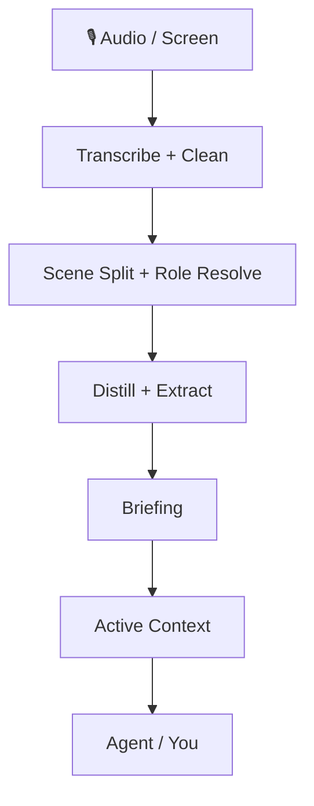

<div align="center">


# 녹음과 화면 활동을, 에이전트가 오래 기억할 수 있는 개인 맥락으로 바꾸세요

OpenMy는 저장된 오디오, 화면 맥락, 하루의 진행 상황을 **조회 가능하고, 수정 가능하며, 날짜를 넘어 누적되는 기억**으로 정리합니다. 직접 일일 보고서를 읽을 수도 있고, 같은 상태를 자신의 에이전트에 연결할 수도 있습니다.

[](https://github.com/openmy-ai/openmy/releases)
[](LICENSE)
[](https://python.org)
[]()

**언어 버전:** [中文](README.md) · [English](README.en.md) · **한국어** · [Français](README.fr.md) · [Italiano](README.it.md) · [日本語](README.ja.md)

</div>

---

## 먼저 얻게 되는 것

- **일일 브리핑**: 요약, 타임라인, 표, 차트가 들어간 하루 정리
- **활성 맥락**: 프로젝트, 사람, 할 일, 사실을 날짜를 넘어 이어서 유지
- **수정 루프**: 이름, 역할, 판단을 고칠수록 결과가 더 정확해짐
- **안정된 진입점**: 사람과 에이전트가 같은 상태를 같은 방식으로 읽을 수 있음

---

## 왜 이것이 단순 전사 도구가 아닌가

OpenMy는 오디오를 글로 바꾸는 데서 끝나지 않습니다.

그다음에 계속 진행합니다.

1. 하루를 장면 단위로 나눕니다
2. 누구와 이야기했는지, 무슨 일이 있었는지 정리합니다
3. 일일 브리핑과 구조화된 결과를 만듭니다
4. 진행 중인 프로젝트, 사람, 열린 항목을 장기 맥락으로 누적합니다

그래서 OpenMy는 **개인 맥락 엔진**이지, 한 번 쓰고 끝나는 전사 도구가 아닙니다.

> OpenMy는 실시간 녹음 앱이 아닙니다. 이미 저장된 녹음과 같은 날의 선택적 화면 맥락을 처리합니다.

---

## ⚡ 1분 안에 실행하기

```bash
git clone https://github.com/openmy-ai/openmy.git && cd openmy
python3 -m venv .venv && source .venv/bin/activate
pip install .
openmy quick-start --demo
```

> 필요한 것은 Python 3.10+와 FFmpeg뿐입니다.
> `--demo`는 내 파일로 바꾸기 전에 전체 흐름이 제대로 도는지 먼저 확인할 수 있게 해 줍니다.

### 데모가 끝난 뒤 다음 단계

```bash
openmy skill health.check --json
openmy quick-start path/to/your-audio.wav
```

- `health.check`: 현재 환경에 맞는 추천 경로를 먼저 보여 줍니다
- `quick-start`: 첫 설정이 덜 끝났다면 잠깐 멈추고 다음으로 뭘 해야 하는지 안내합니다

### 음성-텍스트 엔진은 어떻게 고르면 되나

처음부터 모든 엔진을 직접 비교하지 마세요. 이 순서가 가장 안전합니다.

1. `health.check`를 먼저 실행하고 추천 경로를 따릅니다
2. 녹음이 대부분 한국어나 중국어 계열이고 로컬 우선이면 `funasr`부터 시작합니다
3. 가장 무난한 로컬 경로가 필요하면 `faster-whisper`를 씁니다
4. 로컬 경로가 맞지 않거나 설치를 더 줄이고 싶을 때만 클라우드 경로를 봅니다

클라우드 선택지인 `gemini`, `groq`, `dashscope`, `deepgram`은 준비되어 있지만, 처음부터 고민할 필요는 없습니다.

- `GEMINI_API_KEY`는 오디오 처리의 선행 조건이 아니며, 뒤쪽의 대형 모델 기반 정리 단계에만 영향을 줍니다

---

## 이런 사람에게 맞습니다

### 1. 음성 메모, 회의, 아이디어를 하루 단위로 정리하고 싶은 사람
원본 녹음 파일 더미 대신, 읽을 수 있는 하루 요약으로 바꿔 줍니다.

### 2. 이미 에이전트를 많이 쓰는 사람
에이전트가 매번 다시 묻지 않고, 실제로 있었던 일을 읽을 수 있게 하는 장기 맥락 층으로 쓸 수 있습니다.

### 3. 개인 맥락 작업 흐름을 만드는 개발자
안정된 동작 경계를 자신의 명령줄, 데스크톱 도구, 자동화 흐름에 연결할 수 있습니다.

---

## 출력 결과는 이렇게 생깁니다

<div align="center">

</div>

생성되는 보고서에는 다음이 들어갑니다.

- **Overview** — 장면 수, 글자 수, 발화 시간, 역할 분포
- **Daily briefing** — 하루에 무엇이 있었고 무엇이 아직 중요한지
- **Summary timeline** — 장면별 요약 타임라인
- **Scene table** — 자세한 내용을 펼쳐 볼 수 있는 전체 장면 목록
- **Charts** — 역할과 길이를 시각적으로 정리한 차트
- **Corrections** — 이름, 역할, 판단을 고치는 경로
- **Flow controls** — 특정 단계를 다시 돌리는 경로

---

## 어떻게 동작하나



더 깊은 시스템 설명은 [docs/architecture.md](docs/architecture.md)에서 볼 수 있습니다.

---

## 🤖 OpenMy를 에이전트에 연결하기

핵심 자산은 단일 명령줄 껍데기가 아니라 **지속되는 맥락 상태와 안정된 동작 계약**입니다.

현재 안정적인 JSON 진입점은 다음과 같습니다.

```bash
openmy skill status.get --json
openmy skill day.get --date 2026-04-08 --json
openmy skill context.get --json
openmy skill day.run --date 2026-04-08 --audio path/to/audio.wav --json
```

- `status.get` — 준비 상태와 데이터 존재 여부 확인
- `day.get` — 처리된 하루 읽기
- `context.get` — 날짜를 넘는 활성 맥락 읽기
- `day.run` — 하루를 처리하고 산출물을 저장

예전의 `openmy agent` 진입점도 호환 별칭으로 남아 있습니다.

### 기술 묶음 설치

#### 한 번에 설치

```bash
bash scripts/install-skills.sh
```

이 스크립트는 흔한 에이전트 도구를 감지하고 OpenMy 기술 묶음을 연결합니다.

#### 수동 연결할 때 중요한 디렉터리

- `skills/openmy/`
- `skills/openmy-startup-context/`
- `skills/openmy-context-read/`
- `skills/openmy-context-query/`
- `skills/openmy-day-run/`
- `skills/openmy-day-view/`
- `skills/openmy-correction-apply/`
- `skills/openmy-status-review/`
- `skills/openmy-vocab-init/`
- `skills/openmy-profile-init/`

---

## 선택 기능

### 화면 인식

OpenMy는 화면 맥락을 하루 결과에 합쳐, 말하던 순간 화면에 무엇이 있었는지 함께 남길 수 있습니다.

이 기능은 선택 사항입니다. 지금은 OpenMy 안의 내장 캡처 흐름을 쓰므로, 별도 로컬 서비스를 따로 설치할 필요가 없습니다. 끄면 음성만 처리하는 모드로 돌아가고, 기본 흐름은 그대로 동작합니다.

### 내보내기

일일 브리핑은 다음으로 내보낼 수 있습니다.

- `Obsidian` — 보관함에 마크다운으로 직접 저장
- `Notion` — 인터페이스를 통해 페이지 생성

내보내기는 선택 사항입니다. 설정하지 않아도 기본 처리 흐름은 끝까지 완료됩니다.

### 폴더 감시 모드

녹음 파일을 폴더에 넣기만 하고 OpenMy가 자동으로 처리하길 원하면, 감시 기능을 켜면 됩니다.

```bash
python3 -m openmy.services.watcher ~/Recordings/OpenMy
```

다음 같은 경우에 잘 맞습니다.
- 휴대전화가 녹음을 컴퓨터로 동기화하는 경우
- 녹음기나 무선 마이크가 고정 폴더에 파일을 쓰는 경우
- 수집과 처리를 분리하고 싶은 경우

감시 기능은 파일이 안정적으로 저장된 뒤 자동으로 처리를 시작합니다. 원하지 않으면 감시 기능을 쓰지 않고 `quick-start`나 `day.run`을 직접 실행해도 됩니다.

### 권장 작업 흐름

먼저 녹음하고, 고정 폴더로 동기화한 뒤, `openmy quick-start`로 확인하고, 수동 경로가 마음에 들면 그때 감시 기능을 켜는 방식이 가장 안정적입니다.

---

## 로드맵

- ~~v0.1~~ ✅ 핵심 처리 흐름 완료
- **v0.2 now** — quick-start, report workspace, correction dictionary, structured extraction, active context
- **v0.3** — multilingual support, stronger cross-day context, Obsidian plugin
- **v1.0** — stable API, plugin system, multiple model backends

---

## 개발

```bash
pip install -e .
uvx ruff check .
python3 -m pytest tests/ -v
```

---

## 현재 기술 구현과 아키텍처 트리

## Current technical implementation and architecture tree

```text
openmy/
├── README.md                          # Chinese landing page
├── README.en.md                       # English landing page
├── pyproject.toml                     # packaging, dependencies, CLI entrypoints
├── .github/                           # CI, templates, dependency update config
├── docs/
│   ├── architecture.md                # extra architecture notes
│   ├── images/                        # banner and report screenshots
│   ├── internal/                      # internal implementation notes
│   └── plans/                         # historical plans and design drafts
├── scripts/
│   └── install-skills.sh              # install skill bundle into common agent tools
├── skills/                            # agent-facing skill bundle
│   ├── openmy/                        # top-level router skill
│   ├── openmy-startup-context/        # load context on startup
│   ├── openmy-context-read/           # read-only context access
│   ├── openmy-context-query/          # structured context query
│   ├── openmy-day-run/                # run one processing day
│   ├── openmy-day-view/               # inspect one processed day
│   ├── openmy-correction-apply/       # write correction actions back
│   ├── openmy-status-review/          # inspect system state
│   ├── openmy-vocab-init/             # initialize vocabulary files
│   ├── openmy-profile-init/           # initialize user profile
│   ├── openmy-screen-recognition/     # screen recognition guidance
│   ├── openmy-distill/                # scene distillation guidance
│   ├── openmy-extract/                # structured extraction guidance
│   ├── openmy-export/                 # export guidance
│   └── openmy-aggregate/              # weekly and monthly aggregation guidance
├── app/                               # local report web app
│   ├── server.py                      # web server entrypoint
│   ├── payloads.py                    # payload assembly for the UI
│   ├── context_api.py                 # context read API
│   ├── pipeline_api.py                # rerun pipeline API
│   ├── job_runner.py                  # background task execution
│   ├── http_handlers.py               # route handlers
│   ├── http_responses.py              # response helpers
│   ├── index.html                     # page shell
│   └── static/                        # frontend scripts and static assets
├── src/openmy/                        # main program code
│   ├── __main__.py                    # module entrypoint
│   ├── cli.py                         # top-level CLI entrypoint
│   ├── config.py                      # environment variables and defaults
│   ├── skill_dispatch.py              # skill command dispatcher with JSON output
│   ├── commands/                      # command action layer
│   │   ├── run.py                     # quick-start, day.run, main pipeline
│   │   ├── context.py                 # context commands
│   │   └── correct.py                 # correction commands
│   ├── domain/                        # domain models and intent models
│   │   ├── models.py                  # core data structures
│   │   └── intent.py                  # intent-related models
│   ├── adapters/                      # external adaptation layer
│   │   ├── transcription/             # transcription adapters
│   │   │   └── gemini_cli.py          # Gemini CLI adapter
│   │   └── screen_recognition/
│   │       └── client.py              # screen recognition client adapter
│   ├── providers/                     # pluggable capability providers
│   │   ├── base.py                    # shared provider base class
│   │   ├── registry.py                # provider registry
│   │   ├── llm/
│   │   │   └── gemini.py              # LLM integration
│   │   ├── stt/
│   │   │   ├── faster_whisper.py      # local English-first transcription
│   │   │   ├── funasr.py              # local Chinese-first transcription
│   │   │   ├── gemini.py              # Gemini speech transcription
│   │   │   ├── groq_whisper.py        # Groq speech transcription
│   │   │   ├── dashscope_asr.py       # DashScope speech transcription
│   │   │   └── deepgram.py            # Deepgram speech transcription
│   │   └── export/
│   │       ├── obsidian.py            # export to Obsidian
│   │       └── notion.py              # export to Notion
│   ├── services/                      # pipeline and system services
│   │   ├── ingest/
│   │   │   ├── audio_pipeline.py      # audio read, chunk, transcribe pipeline
│   │   │   └── transcription_enrichment.py # transcript enrichment
│   │   ├── cleaning/
│   │   │   └── cleaner.py             # rule-based cleanup and dictionary application
│   │   ├── segmentation/
│   │   │   └── segmenter.py           # scene segmentation
│   │   ├── roles/
│   │   │   └── resolver.py            # scene role resolution
│   │   ├── distillation/
│   │   │   └── distiller.py           # scene summary generation
│   │   ├── extraction/
│   │   │   └── extractor.py           # day-level structured extraction
│   │   ├── briefing/
│   │   │   ├── generator.py           # daily briefing generation
│   │   │   └── cli.py                 # briefing CLI
│   │   ├── context/
│   │   │   ├── active_context.py      # active-context read/write
│   │   │   ├── consolidation.py       # cross-day merge and open-loop handling
│   │   │   ├── corrections.py         # correction writeback
│   │   │   └── renderer.py            # compact context rendering
│   │   ├── query/
│   │   │   ├── context_query.py       # context query entrypoint
│   │   │   └── search_index.py        # search index
│   │   ├── aggregation/
│   │   │   ├── weekly.py              # weekly aggregation
│   │   │   └── monthly.py             # monthly aggregation
│   │   ├── onboarding/
│   │   │   └── state.py               # first-run state tracking
│   │   ├── screen_recognition/
│   │   │   ├── capture.py             # screen capture pipeline
│   │   │   ├── provider.py            # screen capability entrypoint
│   │   │   ├── settings.py            # screen settings read/write
│   │   │   ├── align.py               # audio/screen alignment
│   │   │   ├── enrich.py              # inject screen context into extraction output
│   │   │   ├── hints.py               # project hints and clue extraction
│   │   │   ├── privacy.py             # privacy filtering
│   │   │   ├── sessionize.py          # screen session grouping
│   │   │   ├── summary.py             # screen summary generation
│   │   │   ├── frontmost_context.swift# foreground-window reader
│   │   │   └── apple_vision_ocr.swift # Apple Vision OCR helper
│   │   ├── scene_quality.py           # crosstalk and low-signal detection
│   │   └── watcher.py                 # folder watcher
│   ├── resources/                     # default vocabulary and correction resources
│   └── utils/
│       ├── io.py                      # file I/O helpers
│       └── time.py                    # time helpers
├── data/                              # local runtime output and state
│   ├── YYYY-MM-DD/                    # one-day result directories
│   ├── runtime/                       # screen settings, jobs, runtime state
│   ├── weekly/                        # weekly aggregates
│   ├── monthly/                       # monthly aggregates
│   ├── profile.json                   # user profile
│   ├── onboarding_state.json          # first-run progress
│   └── search_index.json              # cached search index
└── tests/
    ├── fixtures/                      # sample audio and scene fixtures
    ├── unit/                          # unit tests
    ├── test_weekly_aggregation.py     # weekly aggregation tests
    └── test_monthly_aggregation.py    # monthly aggregation tests
```

### Main processing chain

```text
quick-start / day.run
└── ingest — audio transcription
    └── cleaning — text cleanup
        └── segmentation — scene split
            └── roles — role resolution
                └── distillation — scene summaries
                    └── extraction — structured extraction
                        └── briefing — daily report generation
                            └── context — active-context update
                                └── export / app / skills — export, UI, agent access
```

For deeper supporting notes, see [docs/architecture.md](docs/architecture.md).

---

[CONTRIBUTING](CONTRIBUTING.md) · [CODE_OF_CONDUCT](CODE_OF_CONDUCT.md) · [SECURITY](SECURITY.md) · [MIT License](LICENSE)

If this is useful, a ⭐ helps a lot.
