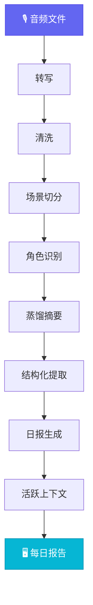

<div align="center">


**面向多 Agent 的个人上下文引擎**

把录音、屏幕等个人原始信号处理成可被 Agent 调用、可纠正、可跨天积累的上下文状态。默认推荐 Gemini provider，但系统本体不绑定单一模型供应商。

[](https://github.com/openmy-ai/openmy/releases)
[](LICENSE)
[](https://python.org)
[]()

[English](README.en.md)

</div>

---

## ⚡ 快速开始

```bash
git clone https://github.com/openmy-ai/openmy.git && cd openmy
python3 -m venv .venv && source .venv/bin/activate
pip install .
echo "GEMINI_API_KEY=你的key" > .env
openmy skill vocab.init --json
openmy quick-start path/to/your-audio.wav
```

> 依赖：Python 3.10+、FFmpeg、一个可用的 provider key。默认推荐 Gemini，直接填 `GEMINI_API_KEY` 即可。

**首次使用：初始化你的个人词库**
```bash
openmy skill vocab.init --json
```

这个命令会从内置示例自动创建 `corrections.json` 和 `vocab.txt`。
这两个文件已加入 `.gitignore`，你可以自由加入自己的错词纠正和专有名词，不会被提交。

### Provider 配置

- 默认推荐：`GEMINI_API_KEY`
- 也支持这些额外转写引擎：

| Provider | 类型 | 更适合谁 | 需要什么 |
|---|---|---|---|
| `faster-whisper` | 本地 | 想省钱、想本地跑 | 直接可用 |
| `funasr` | 本地 | 中文场景 | 安装 `funasr` |
| `gemini` | 接口 | 想少折腾 | `GEMINI_API_KEY` |
| `groq` | 接口 | 想要便宜又快 | `GROQ_API_KEY` |
| `dashscope` | 接口 | 中文和方言优先 | `DASHSCOPE_API_KEY` |
| `deepgram` | 接口 | 英文优先 | `DEEPGRAM_API_KEY` |

如果你要试更强的中文本地模型，可以继续用 `funasr`，再把 `.env` 里的 `OPENMY_STT_MODEL=SenseVoiceSmall` 加上。

切换方式很简单，在 `.env` 里写：`OPENMY_STT_PROVIDER=groq`

- 更通用的配置名：
  - `OPENMY_STT_PROVIDER`
  - `OPENMY_STT_MODEL`
  - `OPENMY_STT_API_KEY`
  - `OPENMY_LLM_PROVIDER`
  - `OPENMY_LLM_MODEL`
  - `OPENMY_LLM_API_KEY`
- 阶段级模型覆盖：
  - `OPENMY_EXTRACT_MODEL`
  - `OPENMY_DISTILL_MODEL`

---

## 🔬 处理流程



### 每一步做什么

**转写** — 音频转成带时间戳的逐字文本。

**清洗** — 去掉口语噪音（嗯、啊、重复词），修标点，应用纠错词典。纯规则，不调 API。

**场景切分** — 按时间间隔和话题转换，把一整天的文本切成独立的对话段落。

**角色识别** — 判断每段对话在跟谁说话：AI 助手、朋友、商家、宠物、自言自语。结合屏幕上下文提高准确率。

**蒸馏摘要** — 每个场景压缩成一到两句话，保留核心信息，感知角色身份。

**结构化提取** — 从全天内容中分桶提取三类信息：
- 🚀 **事件** — 做了什么、打算做什么
- 📌 **事实** — 确认的信息、数据、结论
- ⚡ **洞察** — 想法、判断、灵感

**日报生成** — 汇总当天所有场景，生成有摘要、有时间线、有统计的每日报告。

**活跃上下文** — 跨天累积项目进展、人物关系、待办事项。7 天没再提到的自动标记过期。

---

## 🤖 接给 Agent

OpenMy 的核心资产不是某个 CLI 壳子，而是稳定的上下文状态和动作契约。

当前推荐的稳定入口：

```bash
openmy skill status.get --json
openmy skill day.get --date 2026-04-08 --json
openmy skill context.get --json
openmy skill day.run --date 2026-04-08 --audio path/to/audio.wav --json
```

兼容入口 `openmy agent` 仍然保留，但后续会逐步退到兼容别名。

### Install Skills for Your Agent

如果你要把 OpenMy 接进自己的 Agent（助手程序），把这些 Skill（技能说明文件）一起带上：

- `skills/openmy/`
- `skills/openmy-startup-context/`
- `skills/openmy-context-read/`
- `skills/openmy-context-query/`
- `skills/openmy-day-run/`
- `skills/openmy-day-view/`
- `skills/openmy-correction-apply/`
- `skills/openmy-status-review/`
- `skills/openmy-vocab-init/`
- `skills/openmy-profile-init/`

这样 Agent（助手程序）就知道：什么时候先看状态，什么时候该跑一天，什么时候该主动建议补词库和用户资料。

---

## 🖼️ 输出效果

<div align="center">

</div>

生成的报告包含 7 个视图：

- **概览** — 当天统计：场景数、字数、语音时长、角色分布
- **日报** — 结构化的每日摘要
- **摘要时间线** — 按时间排列每个场景的蒸馏结果
- **场景表格** — 完整场景列表，可展开查看原文
- **图表** — 角色分布和场景时长可视化
- **校正** — 纠错词典管理，支持全局搜索替换
- **流程** — 重跑管线任意阶段

---

## 📤 导出

处理完的日报，现在可以自动导出到两种地方：

- `Obsidian`：直接写成 Markdown 文件到你的笔记库文件夹
- `Notion`：通过接口自动建页面

这块是可选功能。
如果没配好，只会跳过导出，不会拦住主流程，也不会影响 quick-start / run 的主链路。

## 🖥️ 屏幕识别

OpenMy 还能接入屏幕识别，让它知道你说这段话的时候，屏幕上正在干什么。
这样日报会更完整。

这块也是可选功能，而且默认按本地模式处理。
如果本地屏幕服务没开，OpenMy 会退回纯语音模式，不会卡住，也不会影响主流程继续生成日报。

## 👀 自动监听文件夹模式

如果你习惯把录音先丢到某个文件夹里，让 OpenMy 自动处理，可以直接跑 watcher：

```bash
python3 -m openmy.services.watcher ~/Recordings/OpenMy
```

- 适合 DJI Mic 这类会按日期命名音频文件的设备
- 有 `watchdog` 时走事件监听；没有时会自动降级成目录扫描模式
- 录音稳定落盘后会自动触发 `openmy run <date> --audio ...`
- 这是增强模式，不开 watcher 也完全不影响你手动运行 `quick-start` 或 `run`

## 📥 推荐录音采集工作流

推荐一个最省心的方式：

1. 手机 / 录音笔 / DJI Mic 先录音
2. 用 AirDrop、iCloud Drive、Dropbox 或 NAS 把音频同步到电脑上的固定文件夹
3. 要么手动运行 `openmy quick-start path/to/audio.wav`，要么让 watcher 自动监听那个文件夹

这样你可以把“采集”和“处理”分开：录音设备只负责稳定记录，OpenMy 只负责在电脑上做转写、提取和生成日报。


## 📍 路线图

- ~~**v0.1**~~ ✅ 核心管线跑通
- **v0.2** 🟢 当前 — quick-start、报告工作台、纠错词典、结构化提取、活跃上下文
- **v0.3** 🔜 多语言、跨天上下文增强、Obsidian 插件
- **v1.0** 📋 稳定 API、插件系统、多 LLM 后端

---

## 🧪 开发

```bash
pip install -e .
uvx ruff check .
python3 -m pytest tests/ -v   # 328 tests，不需要 API key
```

---

## 📂 仓库结构

```
src/openmy/
  commands/          CLI / skill 入口
  providers/         STT / LLM provider 边界
  services/
    ingest/            音频导入与预处理
    cleaning/          文本清洗（规则引擎）
    segmentation/      场景切分
    roles/             角色识别
    distillation/      蒸馏摘要
    extraction/        结构化提取
    briefing/          日报生成
    context/           活跃上下文
    screen_recognition/  屏幕上下文
  adapters/
    transcription/    旧转写兼容壳
app/                  报告页面
tests/                自动化测试
```

---

[CONTRIBUTING](CONTRIBUTING.md) · [Code of Conduct](CODE_OF_CONDUCT.md) · [Security](SECURITY.md) · [Discussions](https://github.com/openmy-ai/openmy/discussions) · [MIT License](LICENSE) · by [Joseph Zhou](https://github.com/openmy-ai)

<div align="center">

**觉得有用？⭐ 就是最大的支持。**

</div>
