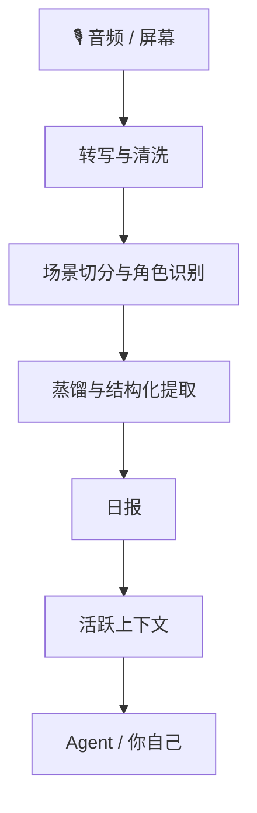

<div align="center">


# 100% 本地处理 · Agent-First · 可纠正

把录音和屏幕变成你的 Agent 能长期记住的个人上下文——数据不出本机，转写错了能改，改了下次更准。

[](https://github.com/openmy-ai/openmy/releases)
[](LICENSE)
[](https://python.org)
[]()

**语言版本：** **中文** · [English](README.en.md) · [한국어](README.ko.md) · [Français](README.fr.md) · [Italiano](README.it.md) · [日本語](README.ja.md)

</div>

---

## 你会先得到什么

- **当天日报**：把录音和场景整理成能直接看的总结、时间线和表格
- **活跃上下文**：把项目、人物、待办和事实跨天攒起来，不用每天从头讲
- **可纠正系统**：错词、错人、错判断都能回改，下次会更准
- **稳定入口**：既能自己看，也能让 Agent 按固定动作读取和继续处理

---

## 为什么它不是普通转写工具

OpenMy 不只是把音频变成文字。

它会继续往下做四件事：

1. 把一天内容切成独立场景
2. 判断这段话在和谁说、在做什么
3. 生成日报和结构化结果
4. 把还在推进的项目、人物和待办沉淀进长期上下文

所以它更像一个**个人上下文引擎**，不是一次性的录音整理器。

> OpenMy 不负责现场录音；它负责处理你已经录下来的音频和当天屏幕信息。

---

## ⚡ 一分钟跑起来

```bash
git clone https://github.com/openmy-ai/openmy.git && cd openmy
bash scripts/install-skills.sh
openmy quick-start --demo
```

> 依赖只有两样：Python 3.10+ 和 FFmpeg。
> `install-skills.sh` 会自动创建虚拟环境、安装依赖、给你的 Agent 工具（Claude Code / Gemini CLI / Codex）链接技能说明。
> `--demo` 会先跑内置示例，先确认整条链路能走通，再换你自己的音频。

<details>
<summary>如果你只想快速试用（不需要 Agent 技能）</summary>

```bash
pip install openmy
openmy quick-start --demo
```

> ⚠️ 这种方式安装后，Agent 工具（Claude Code 等）无法读到技能说明。
> 如果你想让 Agent 帮你操作 OpenMy，请用上面的 `git clone` 方式。

</details>

### 跑通演示以后，下一步怎么做

```bash
openmy skill health.check --json
openmy quick-start path/to/your-audio.wav
```

- `health.check`：先给你一条推荐路线，不用自己在六种转写引擎里瞎挑
- `quick-start`：如果还没配好，它会先拦一下，再告诉你现在最适合走哪条路

### 第一次怎么选转写引擎

先别自己硬挑。建议这样走：

1. 先跑 `health.check`，看系统推荐你走哪条路
2. 如果你主要是中文录音，而且想先本地跑，通常先用 `funasr`
3. 如果你想先稳稳跑通，本地通用路线就用 `faster-whisper`
4. 只有当本地路线不顺，或者你明确想少折腾，再看云端路线

云端选择（`gemini`、`groq`、`dashscope`、`deepgram`）都放在后面再看。

- `GEMINI_API_KEY` 不是音频处理前置条件；它只影响蒸馏、提取这类后段整理

---

## 适合谁

### 1. 想把每天语音整理成日报的人
你可以把随手录下来的语音、会议、灵感、碎念整理成当天报告，不再靠回忆拼时间线。

### 2. 已经重度使用 Agent 的人
你可以把 OpenMy 变成 Agent 的长期记忆层，让它直接读取上下文，而不是每次都重头问你。

### 3. 想做个人上下文工作流的开发者
你可以把现成的稳定动作接到自己的命令行、桌面工具、自动流程里。

## 真实用例

- [我每天怎么用 OpenMy 收上下文](docs/examples/daily-context-workflow.md)
- [怎么让 Agent 直接读你的上下文](docs/examples/agent-context-handoff.md)
- [用户故事模板](docs/examples/owner-story-template.md)

## 社区

- GitHub Discussions（仓库讨论区）：https://github.com/openmy-ai/openmy/discussions

---

## 最后产物长什么样

<div align="center">

</div>

处理完成后，你会得到这些视图：

- **概览**：场景数、字数、语音时长、角色分布
- **日报**：当天发生了什么、接下来要盯什么
- **摘要时间线**：每个场景的精简结果
- **场景表格**：完整列表，可回看原文
- **图表**：角色分布和场景时长可视化
- **校正**：错词、错人、错判断的纠正入口
- **流程**：可以重跑任意阶段

---

## 它怎么工作



如果你想看更细的设计，直接看 [docs/architecture.md](docs/architecture.md)。

---

## 🤖 怎么接给你的 Agent

### 30 秒接入你的 Agent

把这段话直接发给你的 Agent：

> 帮我装上 OpenMy。先 clone 仓库：`git clone https://github.com/openmy-ai/openmy.git`
> 然后进目录跑 `bash scripts/install-skills.sh`，再跑内置 demo 让我看看效果。

正常情况下，Agent 会自己做完这几步：

1. Clone 仓库，进入目录
2. 运行 `install-skills.sh`（自动装依赖 + 链接技能说明）
3. 跑内置 demo（`openmy quick-start --demo`）
4. 打开本地页面 `localhost:8420` 给你看结果

> ⚠️ 不要让 Agent 用 `pip install openmy`，那样它读不到技能说明。

OpenMy 的核心不是某个命令行壳子，而是**稳定的上下文状态 + 稳定的动作契约**。

当前最稳的 JSON 入口：

```bash
openmy skill status.get --json
openmy skill day.get --date 2026-04-08 --json
openmy skill context.get --json
openmy skill day.run --date 2026-04-08 --audio path/to/audio.wav --json
```

- `status.get`：先看现在有没有数据、系统能不能跑
- `day.get`：读某一天的结果
- `context.get`：读跨天活跃上下文
- `day.run`：跑一天并写入结果

兼容入口 `openmy agent` 还保留着，但后面会慢慢退成兼容别名。

### 安装给你的 Agent 用的技能说明

#### 一键安装（所有平台）

```bash
bash scripts/install-skills.sh
```

自动检测你安装了哪些 AI 工具，把 OpenMy 的技能说明链接过去。

#### 分平台安装

<details>
<summary><b>Claude Code</b></summary>

克隆仓库后 `CLAUDE.md` 自动生效。如果还需要手动链接技能：

```bash
bash scripts/install-skills.sh
```

Claude Code 会自动读取项目根目录的 `CLAUDE.md`，里面包含所有行为规则和 Skill 路由。

</details>

<details>
<summary><b>Codex</b></summary>

告诉 Codex：

> Fetch and follow instructions from https://raw.githubusercontent.com/openmy-ai/openmy/refs/heads/main/.codex/INSTALL.md

或者克隆仓库后运行 `bash scripts/install-skills.sh`，会自动链接到 `~/.agents/skills/`。

</details>

<details>
<summary><b>Gemini CLI</b></summary>

```bash
gemini skills link /path/to/openmy/skills
```

或者克隆仓库后运行 `bash scripts/install-skills.sh`，会自动链接到 `~/.gemini/skills/`。

</details>

<details>
<summary><b>Antigravity（反重力）</b></summary>

和 Gemini CLI 共用同一套 Skills 目录（`~/.gemini/skills/`）。

```bash
bash scripts/install-skills.sh
```

`GEMINI.md` 已配置好 `@import`，会自动加载路由 Skill。

</details>

### 升级

```bash
openmy self-update
```

如果只是想升级本地转写依赖，再补一条：

```bash
pip install --upgrade "openmy[local]"
```

#### 手动接入时，重点看这些目录

- `skills/openmy/`
- `skills/openmy-startup-context/`
- `skills/openmy-context-read/`
- `skills/openmy-context-query/`
- `skills/openmy-day-run/`
- `skills/openmy-day-view/`
- `skills/openmy-correction-apply/`
- `skills/openmy-status-review/`
- `skills/openmy-vocab-init/`
- `skills/openmy-profile-init/`

---

## 可选能力

### 屏幕识别

OpenMy 可以把屏幕信息一起并进当天结果，让系统知道你说这段话时，屏幕上正在干什么。

这块是可选能力，而且现在就是内置后台采集，不需要再单独装外部服务。
如果你没开它，OpenMy 会退回纯语音模式，不会卡住，也不会影响主流程继续生成日报。

### 导出

日报现在可以自动导出到：

- `Obsidian`：直接写 Markdown 到你的笔记库
- `Notion`：通过接口自动建页面

这块也是可选能力。
如果没配好，只会跳过导出，不会拦住主流程。

### 自动监听文件夹

如果你习惯把录音先丢进固定文件夹，再让系统自己处理，可以直接开 watcher：

```bash
python3 -m openmy.services.watcher ~/Recordings/OpenMy
```

适合这类场景：
- 手机录音同步到电脑
- 录音笔或无线麦自动落到固定目录
- 你想把“采集”和“处理”拆开

OpenMy 会在文件稳定落盘后自动触发处理。不开 watcher 也没关系，手动跑 `quick-start` 或 `day.run` 一样能用。

### 推荐使用方式

先录音，再同步到电脑固定文件夹，最后用 `quick-start` 手动跑；跑顺以后，再决定要不要开 watcher 自动处理。

---

## 路线图

- ~~v0.1~~ ✅ 核心链路跑通
- **v0.2 当前**：quick-start、报告工作台、纠错词典、结构化提取、活跃上下文
- **v0.3**：多语言、跨天上下文增强、Obsidian 插件
- **v1.0**：稳定 API、插件系统、多模型后端

---

## 开发

```bash
pip install -e .
uvx ruff check .
python3 -m pytest tests/ -v
```

---

## 当前技术实现与技术架构树

```text
openmy/
├── README.md                          # 中文首页说明
├── README.en.md                       # 英文首页说明
├── pyproject.toml                     # 打包、依赖、命令入口配置
├── .github/                           # 持续集成、模板、依赖更新配置
├── docs/
│   ├── architecture.md                # 额外架构说明
│   ├── images/                        # 首页横幅、报告截图
│   ├── internal/                      # 内部实现文档
│   └── plans/                         # 历史计划与设计草稿
├── scripts/
│   └── install-skills.sh              # 给常见智能助手安装技能说明
├── skills/                            # 面向智能助手的技能说明目录
│   ├── openmy/                        # 总路由技能
│   ├── openmy-startup-context/        # 启动时读取上下文
│   ├── openmy-context-read/           # 只读上下文
│   ├── openmy-context-query/          # 结构化查询
│   ├── openmy-day-run/                # 处理某一天音频
│   ├── openmy-day-view/               # 查看某一天结果
│   ├── openmy-correction-apply/       # 写回纠错动作
│   ├── openmy-status-review/          # 查看系统状态
│   ├── openmy-vocab-init/             # 初始化词库
│   ├── openmy-profile-init/           # 初始化用户资料
│   ├── openmy-screen-recognition/     # 屏幕识别说明
│   ├── openmy-distill/                # 场景摘要说明
│   ├── openmy-extract/                # 结构化提取说明
│   ├── openmy-export/                 # 导出说明
│   └── openmy-aggregate/              # 周报、月报聚合说明
├── app/                               # 报告页面与本地网页接口
│   ├── server.py                      # 网页服务入口
│   ├── payloads.py                    # 页面读到的数据组装
│   ├── context_api.py                 # 上下文读取接口
│   ├── pipeline_api.py                # 管线重跑接口
│   ├── job_runner.py                  # 后台任务执行
│   ├── http_handlers.py               # 路由分发
│   ├── http_responses.py              # 响应封装
│   ├── index.html                     # 页面骨架
│   └── static/                        # 前端脚本和静态资源
├── src/openmy/                        # 主程序代码
│   ├── __main__.py                    # 模块入口
│   ├── cli.py                         # 命令行总入口
│   ├── config.py                      # 环境变量与默认配置
│   ├── skill_dispatch.py              # skill 子命令分发与 JSON 输出
│   ├── commands/                      # 命令行动作层
│   │   ├── run.py                     # quick-start、day.run、主处理链路
│   │   ├── context.py                 # context 相关命令
│   │   └── correct.py                 # correction 相关命令
│   ├── domain/                        # 领域模型与意图模型
│   │   ├── models.py                  # 核心数据结构
│   │   └── intent.py                  # 意图相关模型
│   ├── adapters/                      # 对外适配层
│   │   ├── transcription/             # 转写外部适配
│   │   │   └── gemini_cli.py          # Gemini 命令行适配
│   │   └── screen_recognition/
│   │       └── client.py              # 屏幕识别客户端适配
│   ├── providers/                     # 可插拔能力提供层
│   │   ├── base.py                    # 提供层公共基类
│   │   ├── registry.py                # 提供层注册中心
│   │   ├── llm/
│   │   │   └── gemini.py              # 大模型能力接入
│   │   ├── stt/
│   │   │   ├── faster_whisper.py      # 本地英文优先转写
│   │   │   ├── funasr.py              # 本地中文优先转写
│   │   │   ├── gemini.py              # Gemini 语音转写
│   │   │   ├── groq_whisper.py        # Groq 语音转写
│   │   │   ├── dashscope_asr.py       # 通义语音转写
│   │   │   └── deepgram.py            # Deepgram 语音转写
│   │   └── export/
│   │       ├── obsidian.py            # 导出到 Obsidian
│   │       └── notion.py              # 导出到 Notion
│   ├── services/                      # 处理链路与系统服务
│   │   ├── ingest/
│   │   │   ├── audio_pipeline.py      # 音频读取、切块、转写主链
│   │   │   └── transcription_enrichment.py # 转写补强
│   │   ├── cleaning/
│   │   │   └── cleaner.py             # 规则清洗、纠错词典应用
│   │   ├── segmentation/
│   │   │   └── segmenter.py           # 场景切分
│   │   ├── roles/
│   │   │   └── resolver.py            # 场景角色识别
│   │   ├── distillation/
│   │   │   └── distiller.py           # 场景摘要生成
│   │   ├── extraction/
│   │   │   └── extractor.py           # 日级结构化提取
│   │   ├── briefing/
│   │   │   ├── generator.py           # 日报生成
│   │   │   └── cli.py                 # 日报命令入口
│   │   ├── context/
│   │   │   ├── active_context.py      # 活跃上下文读写
│   │   │   ├── consolidation.py       # 跨天合并与 open loop 处理
│   │   │   ├── corrections.py         # 纠错动作回写
│   │   │   └── renderer.py            # 紧凑上下文文本渲染
│   │   ├── query/
│   │   │   ├── context_query.py       # 上下文查询入口
│   │   │   └── search_index.py        # 搜索索引
│   │   ├── aggregation/
│   │   │   ├── weekly.py              # 周聚合
│   │   │   └── monthly.py             # 月聚合
│   │   ├── onboarding/
│   │   │   └── state.py               # 首配状态记录
│   │   ├── screen_recognition/
│   │   │   ├── capture.py             # 屏幕捕获主链
│   │   │   ├── provider.py            # 屏幕能力入口
│   │   │   ├── settings.py            # 屏幕设置读写
│   │   │   ├── align.py               # 音频与屏幕时间对齐
│   │   │   ├── enrich.py              # 屏幕上下文补进提取结果
│   │   │   ├── hints.py               # 项目提示与线索抽取
│   │   │   ├── privacy.py             # 隐私过滤
│   │   │   ├── sessionize.py          # 屏幕片段归并
│   │   │   ├── summary.py             # 屏幕摘要生成
│   │   │   ├── frontmost_context.swift# 前台窗口读取
│   │   │   └── apple_vision_ocr.swift # 苹果视觉识别脚本
│   │   ├── scene_quality.py           # 串台和低信号检测
│   │   └── watcher.py                 # 自动监听目录
│   ├── resources/                     # 默认词库、示例纠错资源
│   └── utils/
│       ├── io.py                      # 文件读写辅助
│       └── time.py                    # 时间处理辅助
├── data/                              # 本地运行产物与状态
│   ├── YYYY-MM-DD/                    # 单日处理结果目录
│   ├── runtime/                       # 屏幕设置、作业状态等运行时数据
│   ├── weekly/                        # 周聚合结果
│   ├── monthly/                       # 月聚合结果
│   ├── profile.json                   # 用户资料
│   ├── onboarding_state.json          # 首配进度
│   └── search_index.json              # 搜索索引缓存
└── tests/
    ├── fixtures/                      # 测试样本音频与场景样本
    ├── unit/                          # 单元测试
    ├── test_weekly_aggregation.py     # 周聚合测试
    └── test_monthly_aggregation.py    # 月聚合测试
```

### 主处理链路

```text
quick-start / day.run
└── ingest（音频转写）
    └── cleaning（文本清洗）
        └── segmentation（场景切分）
            └── roles（角色识别）
                └── distillation（场景摘要）
                    └── extraction（结构化提取）
                        └── briefing（日报生成）
                            └── context（活跃上下文更新）
                                └── export / app / skills（导出、页面、Agent 读取）
```

更细的补充说明可以看 [docs/architecture.md](docs/architecture.md)。

---

[CONTRIBUTING](CONTRIBUTING.md) · [CODE_OF_CONDUCT](CODE_OF_CONDUCT.md) · [SECURITY](SECURITY.md) · [MIT License](LICENSE)

如果这项目对你有帮助，欢迎点个 ⭐。
