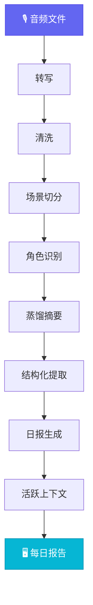

<div align="center">


**一段音频 → 一整天的结构化上下文**

开源个人上下文引擎。录一段音频，自动完成转写、清洗、场景切分、角色识别、摘要蒸馏、结构化提取，生成可浏览的每日报告。

[](https://github.com/openmy-ai/openmy/releases)
[](LICENSE)
[](https://python.org)
[]()

[English](README.en.md)

</div>

---

## ⚡ 快速开始

```bash
git clone https://github.com/openmy-ai/openmy.git && cd openmy
python3 -m venv .venv && source .venv/bin/activate
pip install .
echo "GEMINI_API_KEY=你的key" > .env
openmy quick-start path/to/your-audio.wav
```

> 依赖：Python 3.10+、FFmpeg、一个 Gemini API Key。

---

## 🔬 处理流程



### 每一步做什么

**转写** — 音频转成带时间戳的逐字文本。

**清洗** — 去掉口语噪音（嗯、啊、重复词），修标点，应用纠错词典。纯规则，不调 API。

**场景切分** — 按时间间隔和话题转换，把一整天的文本切成独立的对话段落。

**角色识别** — 判断每段对话在跟谁说话：AI 助手、朋友、商家、宠物、自言自语。结合屏幕上下文提高准确率。

**蒸馏摘要** — 每个场景压缩成一到两句话，保留核心信息，感知角色身份。

**结构化提取** — 从全天内容中分桶提取三类信息：
- 🚀 **事件** — 做了什么、打算做什么
- 📌 **事实** — 确认的信息、数据、结论
- ⚡ **洞察** — 想法、判断、灵感

**日报生成** — 汇总当天所有场景，生成有摘要、有时间线、有统计的每日报告。

**活跃上下文** — 跨天累积项目进展、人物关系、待办事项。7 天没再提到的自动标记过期。

---

## 🖼️ 输出效果

<div align="center">

</div>

生成的报告包含 7 个视图：

- **概览** — 当天统计：场景数、字数、语音时长、角色分布
- **日报** — 结构化的每日摘要
- **摘要时间线** — 按时间排列每个场景的蒸馏结果
- **场景表格** — 完整场景列表，可展开查看原文
- **图表** — 角色分布和场景时长可视化
- **校正** — 纠错词典管理，支持全局搜索替换
- **流程** — 重跑管线任意阶段

---

## 📍 路线图

- ~~**v0.1**~~ ✅ 核心管线跑通
- **v0.2** 🟢 当前 — quick-start、报告工作台、纠错词典、结构化提取、活跃上下文
- **v0.3** 🔜 多语言、跨天上下文增强、Obsidian 插件
- **v1.0** 📋 稳定 API、插件系统、多 LLM 后端

---

## 🧪 开发

```bash
pip install -e .
python3 -m pytest tests/ -v   # 167 tests，不需要 API key
```

---

## 📂 仓库结构

```
src/openmy/
  services/
    ingest/            音频导入与预处理
    cleaning/          文本清洗（规则引擎）
    segmentation/      场景切分
    roles/             角色识别
    distillation/      蒸馏摘要
    extraction/        结构化提取
    briefing/          日报生成
    context/           活跃上下文
    screen_recognition/  屏幕上下文
app/                  报告页面
tests/                自动化测试
```

---

[CONTRIBUTING](CONTRIBUTING.md) · [MIT License](LICENSE) · by [Joseph Zhou](https://github.com/openmy-ai)

<div align="center">

**觉得有用？⭐ 就是最大的支持。**

</div>
