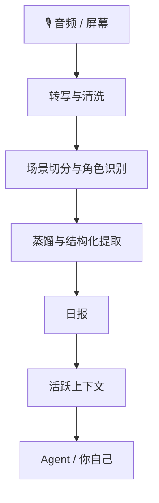

<div align="center">


# 把录音和屏幕，变成能被 Agent 长期记住的个人上下文

OpenMy 会把已经落盘的音频、屏幕和每天的进展整理成**可查询、可纠正、可跨天积累**的上下文状态。你可以自己看日报，也可以把它接进自己的 Agent。

[](https://github.com/openmy-ai/openmy/releases)
[](LICENSE)
[](https://python.org)
[]()

[English](README.en.md)

</div>

---

## 你会先得到什么

- **当天日报**：把录音和场景整理成能直接看的总结、时间线和表格
- **活跃上下文**：把项目、人物、待办和事实跨天攒起来，不用每天从头讲
- **可纠正系统**：错词、错人、错判断都能回改，下次会更准
- **稳定入口**：既能自己看，也能让 Agent 按固定动作读取和继续处理

---

## 为什么它不是普通转写工具

OpenMy 不只是把音频变成文字。

它会继续往下做四件事：

1. 把一天内容切成独立场景
2. 判断这段话在和谁说、在做什么
3. 生成日报和结构化结果
4. 把还在推进的项目、人物和待办沉淀进长期上下文

所以它更像一个**个人上下文引擎**，不是一次性的录音整理器。

> OpenMy 不负责现场录音；它负责处理你已经录下来的音频和当天屏幕信息。

---

## ⚡ 一分钟跑起来

```bash
git clone https://github.com/openmy-ai/openmy.git && cd openmy
python3 -m venv .venv && source .venv/bin/activate
pip install .
openmy quick-start --demo
```

> 依赖只有两样：Python 3.10+ 和 FFmpeg。
> `--demo` 会先跑内置示例，先确认整条链路能走通，再换你自己的音频。

### 跑通演示以后，下一步怎么做

```bash
openmy skill health.check --json
openmy quick-start path/to/your-audio.wav
```

- `health.check`：先给你一条推荐路线，不用自己在六种转写引擎里瞎挑
- `quick-start`：如果还没配好，它会先拦一下，再告诉你现在最适合走哪条路

### 第一次怎么选转写引擎

先别自己硬挑。建议这样走：

1. 先跑 `health.check`，看系统推荐你走哪条路
2. 如果你主要是中文录音，而且想先本地跑，通常先用 `funasr`
3. 如果你想先稳稳跑通，本地通用路线就用 `faster-whisper`
4. 只有当本地路线不顺，或者你明确想少折腾，再看云端路线

云端选择（`gemini`、`groq`、`dashscope`、`deepgram`）都放在后面再看。

- `GEMINI_API_KEY` 不是音频处理前置条件；它只影响蒸馏、提取这类后段整理

---

## 适合谁

### 1. 想把每天语音整理成日报的人
你可以把随手录下来的语音、会议、灵感、碎念整理成当天报告，不再靠回忆拼时间线。

### 2. 已经重度使用 Agent 的人
你可以把 OpenMy 变成 Agent 的长期记忆层，让它直接读取上下文，而不是每次都重头问你。

### 3. 想做个人上下文工作流的开发者
你可以把现成的稳定动作接到自己的命令行、桌面工具、自动流程里。

---

## 最后产物长什么样

<div align="center">

</div>

处理完成后，你会得到这些视图：

- **概览**：场景数、字数、语音时长、角色分布
- **日报**：当天发生了什么、接下来要盯什么
- **摘要时间线**：每个场景的精简结果
- **场景表格**：完整列表，可回看原文
- **图表**：角色分布和场景时长可视化
- **校正**：错词、错人、错判断的纠正入口
- **流程**：可以重跑任意阶段

---

## 它怎么工作



如果你想看更细的设计，直接看 [docs/architecture.md](docs/architecture.md)。

---

## 🤖 怎么接给你的 Agent

OpenMy 的核心不是某个命令行壳子，而是**稳定的上下文状态 + 稳定的动作契约**。

当前最稳的 JSON 入口：

```bash
openmy skill status.get --json
openmy skill day.get --date 2026-04-08 --json
openmy skill context.get --json
openmy skill day.run --date 2026-04-08 --audio path/to/audio.wav --json
```

- `status.get`：先看现在有没有数据、系统能不能跑
- `day.get`：读某一天的结果
- `context.get`：读跨天活跃上下文
- `day.run`：跑一天并写入结果

兼容入口 `openmy agent` 还保留着，但后面会慢慢退成兼容别名。

### 安装给你的 Agent 用的技能说明

#### 一键安装

```bash
bash scripts/install-skills.sh
```

这个脚本会自动识别常见 Agent 工具，把对应技能说明链接过去。

#### 手动接入时，重点看这些目录

- `skills/openmy/`
- `skills/openmy-startup-context/`
- `skills/openmy-context-read/`
- `skills/openmy-context-query/`
- `skills/openmy-day-run/`
- `skills/openmy-day-view/`
- `skills/openmy-correction-apply/`
- `skills/openmy-status-review/`
- `skills/openmy-vocab-init/`
- `skills/openmy-profile-init/`

---

## 可选能力

### 屏幕识别

OpenMy 可以把屏幕信息一起并进当天结果，让系统知道你说这段话时，屏幕上正在干什么。

这块是可选能力，而且现在就是内置后台采集，不需要再单独装外部服务。
如果你没开它，OpenMy 会退回纯语音模式，不会卡住，也不会影响主流程继续生成日报。

### 导出

日报现在可以自动导出到：

- `Obsidian`：直接写 Markdown 到你的笔记库
- `Notion`：通过接口自动建页面

这块也是可选能力。
如果没配好，只会跳过导出，不会拦住主流程。

### 自动监听文件夹

如果你习惯把录音先丢进固定文件夹，再让系统自己处理，可以直接开 watcher：

```bash
python3 -m openmy.services.watcher ~/Recordings/OpenMy
```

适合这类场景：
- 手机录音同步到电脑
- 录音笔或无线麦自动落到固定目录
- 你想把“采集”和“处理”拆开

OpenMy 会在文件稳定落盘后自动触发处理。不开 watcher 也没关系，手动跑 `quick-start` 或 `day.run` 一样能用。

### 推荐使用方式

先录音，再同步到电脑固定文件夹，最后用 `quick-start` 手动跑；跑顺以后，再决定要不要开 watcher 自动处理。

---

## 路线图

- ~~v0.1~~ ✅ 核心链路跑通
- **v0.2 当前**：quick-start、报告工作台、纠错词典、结构化提取、活跃上下文
- **v0.3**：多语言、跨天上下文增强、Obsidian 插件
- **v1.0**：稳定 API、插件系统、多模型后端

---

## 开发

```bash
pip install -e .
uvx ruff check .
python3 -m pytest tests/ -v
```

---

## 仓库大致结构

```text
src/openmy/                核心源码
app/                       报告页面
skills/                    Agent 技能说明
docs/                      设计与补充文档
tests/                     自动化测试
```

更细的实现结构可以看 [docs/architecture.md](docs/architecture.md)。

---

[CONTRIBUTING](CONTRIBUTING.md) · [CODE_OF_CONDUCT](CODE_OF_CONDUCT.md) · [SECURITY](SECURITY.md) · [MIT License](LICENSE)

如果这项目对你有帮助，欢迎点个 ⭐。
