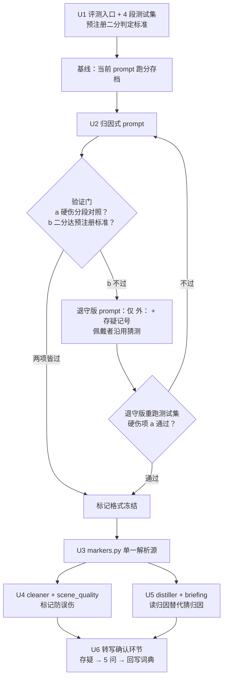

# feat: 归因式转写落地——测试集、归因 prompt、下游适配与转写确认

## Summary

依据 `CONTEXT.md` 与 `docs/adr/0001-归因式转写替代过滤式转写.md`，把转写从过滤式改为归因式：先建 4 段固定测试集并给当前 prompt 跑硬伤基线，再写归因式 prompt 做对照验证（重点验证佩戴者二分可行性），通过验证门后适配 cleaner / scene_quality / distiller / briefing 全链路，最后实现蒸馏后的转写确认环节（一次最多 5 问，回写 `corrections.json` 与 `vocab.txt`）。

## Problem Frame

现行 prompt（commit 6b23cd6）是过滤式：外放一律不转、不确定内容二选一（硬转或 [无法识别]）、禁止说话人标注。后果已在实际日报中出现——外放教程被写成"我在研究零代码 AI 工作流"、朋友的近况被写成第一人称经历。ADR-0001 已裁决改为归因式（三值确定性 + 三类归因），并明确两条硬约束：归因标记可行性必须先过固定测试集对照实验；标记格式一旦定下难以更换，全部消费方需一次盘清。

---

## Requirements

**评测基建**

- R1. 存在 4 段固定测试集（KTV 段、外放段、方言段、清晰对话基线段），来自 `data/2026-06-05/` 的固定音频文件（三段为 stt_chunks 已切块音频，外放段为原始整段），可重复重跑。
- R2. 评测入口可对同一测试集运行任意版本的转写 prompt，产出新旧版并排对比产物，供按硬伤四类（凑字、歌词混入、外放冒充对话、归因错误）计数。
- R3. 改 prompt 之前先用当前 prompt（6b23cd6）跑出硬伤基线并存档——磁盘上 2026-06-05 的现有转写是更旧 prompt 的产物，不能充当基线。

**转写输出**

- R4. 转写输出支持三值确定性：确定内容直接输出、存疑内容带记号输出、完全听不清标 [无法识别]。
- R5. 转写输出支持三类归因标记（佩戴者、在场他人、外放），标记是封闭枚举，模型不得自创。
- R6. 归因式 prompt 通过验证门才能进入正式管线。验证门分两项：（a）硬伤分段对照——基线也转写了的内容上，归因版四类硬伤逐类不高于基线（持平可过：归因标记本身是新增收益，故门槛取"不高于"而非 CONTEXT.md 的"少于"）；归因版新增转写的外放内容单独计硬伤，不得超过预设上限。直接比总数不可行：基线是过滤式、错误多表现为不计分的遗漏，归因版被计分的文本面更大，原始总数对比会错杀更优的归因版。（b）佩戴者二分按预注册标准判定，标准在跑分前写入测试集清单，不得事后倒推；二分不可用时退守"仅外放标记 + 存疑记号"，退守版 prompt 须重新跑测试集通过（a）项后方可冻结格式。
- R7. 背景伴奏、纯音乐旋律仍不转写（宁漏勿假优先级不变）；外放中的人声内容转写并标外放，佩戴者本人演唱（含 KTV）按佩戴者归因转写。

**下游适配**

- R8. 全部标记经过清洗（含 LLM 纠错轮）后原样存活，不被删除、改写或合并。
- R9. 质量检测（乱码占比、歌词 n-gram、字数门槛）按剥离标记后的净文本判定——标记字符既不触发误杀，存疑记号也不计入 [无法识别] 占比。
- R10. 蒸馏从"猜归因"改为"读归因"：带归因标记的内容读标记——佩戴者内容用"我"，他人内容用具体称呼，外放内容写成"听到/看到的内容"；无标记的内容（其他引擎、历史转写、退守模式的非外放行）沿用现有猜测规则，标记优先于猜测。存疑内容不进日报正文，排除机制是确定性的（不依赖 prompt 遵从）。
- R11. 两个蒸馏入口（`src/openmy/commands/run.py`、`src/openmy/commands/show.py`）和 agent 侧蒸馏路径（`src/openmy/skill_handlers/day_pipeline.py` + `skills/openmy-distill/SKILL.md`）行为一致。

**转写确认**

- R12. 蒸馏完成后可发起转写确认：一次最多 5 个存疑项，只问影响日报内容的（判断标准：该项敲定后日报会不会变）。
- R13. 确认结果回写 `src/openmy/resources/corrections.json`（按 wrong 去重 upsert）和 `vocab.txt`（`词 | 提示` 格式），两条注入通路（STT prompt、LLM 纠错 prompt）下次直接受益；同时修正当日 `transcript.md`。

---

## Key Technical Decisions

- **标记格式（待测试集验证后冻结）**：归因用行级单字前缀——`我：`（佩戴者）、`人：`（在场他人）、`外：`（外放）；存疑用行内 `[?内容]` 包裹；保留 `[无法识别]`、`[无人声]`。理由：单字前缀沿用旧 prompt 时代 Gemini 已稳定产出的 `男：/女：` 形态，对 n-gram 密度检测的字符注入最小；方括号族与现有标记（[助手回复]、[疑似串台]）同形，便于统一剥离。ADR 警告格式难换，因此 U2 验证门通过前不写入任何下游代码。
- **标记解析单一来源**：新建 `src/openmy/services/markers.py` 承载封闭枚举、剥离函数、行级归因解析，cleaner / scene_quality / distiller 全部引用它，不各自写正则。理由：历史教训"改一处漏一处"（上次 usable 过滤漏了 `show.py` 被审查抓出）。
- **硬伤计分由人/agent 对照评判，不做自动评分器**：评测入口只负责"同一测试集 × 多版 prompt → 并排产物"，计数由评审完成。理由：凑字、外放冒充等判定需要对照原音频语境，自动化评分本身会引入新的不可信判定；且 `CONTEXT.md` 对"测试集/硬伤"的定义就是并排对比 + 人工计数。固定阈值自动判定有过误杀 7/11 的前科。
- **保留 6b23cd6 已验证骨架**：三级优先级结构、temperature=0.0、parts 文本在前音频在后、封闭标记枚举、DO/DO NOT 格式全部保留，只把"过滤"层替换为"归因"层。理由：这些是经三轨调研验证的，重起炉灶会丢掉已确认的收益。
- **蒸馏归因按标记存在性门控，标记优先于猜测**：带归因标记的内容读标记（commit 1fdc5b9 引入的猜测规则不参与），无标记的内容（其他 STT 引擎、历史转写、退守模式下的非外放行）沿用猜测规则。理由：ADR 的"从猜改读"只在有标记可读时成立；无条件拆除猜测规则会让 faster-whisper/funasr 等无标记通路从"有猜测归因"回退为"无归因"，是能力回退。两套归因的并存冲突由"标记优先"裁决，不会出现转写标"他人"、蒸馏猜"佩戴者"各执一词。
- **顺手根治 `generate_text` 空返回即报错**（dogfood 阻塞点 #7）：加 `allow_empty` 参数。理由：归因 prompt 下纯外放段、确认环节都可能合法返回空，现状靠 per-scene try/except 掩盖。

---

## High-Level Technical Design

标记在管线中的流向：转写产出带标记正文 → 清洗透传（标记受保护）→ 切段对标记透明（原样进 `scene.text`）→ 质量检测按净文本判定 → 蒸馏读标记定归因、存疑项汇集 → 日报正文不含存疑 → 确认环节消费存疑项、回写词典闭环。

---

## Implementation Units

### U1. Prompt 参数化 + 评测入口 + 固定测试集

- **Goal:** 让转写 prompt 可按版本注入，建立可重复的 4 段测试集评测入口，并给当前 prompt 跑出硬伤基线存档。
- **Requirements:** R1, R2, R3
- **Dependencies:** 无
- **Files:** `src/openmy/providers/stt/gemini.py`（`SYSTEM_INSTRUCTION` / `build_prompt` 参数化，默认值不变）、`scripts/transcribe_eval.py`（新建）、`scripts/eval_testset.json`（新建，测试集清单）、`tests/unit/test_transcribe_eval.py`（新建）
- **Approach:** 测试集清单只存路径与元信息（音频本体在 git-ignored 的 `data/` 下）：基线段 `data/2026-06-05/stt_chunks/audio_001_sub_0000.mp3`（16:50 清晰对话）、方言段 `audio_003_sub_0000.mp3`（19:03）、KTV 段 `audio_007_sub_0000.mp3`（21:03，注意不是 0 秒尾块 chunk_0023）、外放段 `audio_009_TX01_MIC024_20260605_220308_orig.mp3`（22:03）。清单中同时预注册佩戴者二分的"可用"判定标准（R6b），基线存档时定稿、跑 A/B 前不得再改。评测入口接收 prompt 版本标识，逐段调 `GeminiSTTProvider.transcribe()`，输出并排对比 markdown 到 `data/eval/<run-name>/`。基线 run 以当前 prompt 执行并存档计数结论。
- **Patterns to follow:** mock 模式沿用 `tests/unit/test_gemini_cli_transcribe.py` 的 provider patch 写法；脚本风格参照 `scripts/check_readme_sync.py`。
- **Test scenarios:**
  - 清单加载：4 段齐全、字段完整时正常解析；缺文件路径时报告缺哪段而非堆栈。
  - 并排产物组装：给定两版 mock 转写结果，产物按段对齐、含 prompt 版本标识与时间标签。
  - prompt 参数化：不传版本时 `transcribe()` 行为与现状逐字节一致（防默认值回归）。
  - 音频缺失（外置盘未挂载）：明确报错提示音频不在本地，不静默跳过。
- **Verification:** 基线 run 在本地完成，4 段并排产物与硬伤计数结论落盘 `data/eval/baseline-6b23cd6/`；现有转写单测全绿。

### U2. 归因式 SYSTEM_INSTRUCTION + 对照验证门

- **Goal:** 写归因式 prompt，在测试集上与基线对照，验证通过后冻结标记格式。
- **Requirements:** R4, R5, R6, R7
- **Dependencies:** U1
- **Files:** `src/openmy/providers/stt/gemini.py`、`tests/unit/test_gemini_cli_transcribe.py`（prompt 断言更新）
- **Approach:** 保留三级优先级骨架，优先级改为：安全（不编造）> 归因（来源标对）> 完整（人声口述逐字）。DO 区写三类前缀的判定依据（佩戴者=最近最清晰的声音；外放=经设备扬声器的人声）、存疑记号用法（拿不准但未放弃的词/短语包 `[?]`）；DO NOT 区保留禁自创标签、禁伴奏歌词、禁润色。跑测试集 A/B，按 R6 的分段计分法对照基线。**验证门：** （a）基线也转写了的内容上四类硬伤逐类不高于基线，且归因版新增转写的外放内容硬伤不超预设上限；（b）佩戴者二分达到 U1 预注册标准（建议：对话段中我/人归因错误行数不超过归因行总数的 10%，且无整段归因反转）。两项皆过 → 冻结格式进入 U3；（b）不过 → 退守版 prompt（仅 `外：` 前缀 + 存疑记号，不分我/人），退守版必须同样重跑测试集通过（a）项后才冻结格式——零跑分的 prompt 不允许直接冻结铺进下游，其余单元照常，U5 中蒸馏对佩戴者沿用猜测规则。
- **Execution note:** 对照实验先行——prompt 文本进主干前必须有测试集跑分结论；Gemini 转写历史上有过两次假死（连接保持但无新块），跑分时设超时并准备重试。
- **Test scenarios:**
  - prompt 文本断言：含三类前缀定义、存疑记号、[无法识别]/[无人声]；不含已废弃的"不添加说话人标注"。
  - vocab 注入：词表提示仍按 `词（提示）` 格式进 user prompt（U1 参数化未破坏）。
  - generate 配置：temperature=0.0 与 text-first parts 顺序保持。
- **Verification:** `data/eval/` 下有归因版与基线的并排对比和计数结论；验证门结论（通过/退守）写入本计划同目录的实验记录或 commit message。

### U3. markers.py——标记解析单一来源

- **Goal:** 把冻结后的标记格式收口到一个模块，供下游全部消费方引用。
- **Requirements:** R8, R9, R10 的共同前置
- **Dependencies:** U2（格式冻结后才写）
- **Files:** `src/openmy/services/markers.py`（新建）、`tests/unit/test_markers.py`（新建）
- **Approach:** 提供封闭枚举常量、`strip_markers(text)`（剥离归因前缀与存疑括号、保留净文本）、`parse_attribution(line)`（返回来源类别 + 正文）、`iter_uncertain_spans(text)`（枚举存疑片段及所在行，供确认环节）。畸形标记策略一并规定：未闭合的 `[?` 按行尾闭合处理（行余部分计为存疑），空 `[?]` 忽略。退守场景下枚举少两个成员，接口不变。
- **Test scenarios:**
  - 三类前缀各自解析正确；无前缀行返回"未标注"。
  - `strip_markers` 嵌套场景：前缀 + 行内存疑同时存在时净文本正确。
  - 存疑片段枚举：多个 `[?]` 同行、跨行各自命中；`[无法识别]` 不被当成存疑。
  - 畸形标记：未闭合 `[?` 按行尾闭合处理，空 `[?]` 忽略，均不抛错、不吞掉正文。
  - 历史文本兼容：不带任何新标记的旧转写文本经全部函数处理后原样返回。
- **Verification:** 单测全绿；下游单元只 import 本模块，无重复正则。

### U4. cleaner + scene_quality 标记防误伤

- **Goal:** 标记安全通过清洗全流程，质量检测按净文本判定。
- **Requirements:** R8, R9
- **Dependencies:** U3
- **Files:** `src/openmy/services/cleaning/cleaner.py`、`src/openmy/services/scene_quality.py`、`tests/unit/test_clean.py`、`tests/unit/test_scene_quality.py`
- **Approach:** cleaner 逐处排雷：`ENV_NOISE_RE` / `MUSIC_RE` 改为先剥标记再匹配（防 `外：` 行被环境音整行删除）；`is_filler_line` 废词判定同样先取净文本（其 `^` 锚定模式对带前缀行全部失配，否则废词行清理被静默关闭）；`deduplicate_lines` 与 `merge_short_lines` 按净文本判重/判短且要求归因前缀一致——净文本相同但前缀不同的相邻行不去重（"我：好的"对"人：好的"是真实应答），附着词只并入同前缀的上一行，纯标记行不并入上一行；`split_long_paragraphs` 切分带前缀长行时把原前缀重新应用到每个切分片段（否则长独白续段全部失标）；`mark_suspicious_crosstalk` 跳过归因为外放的行（`外：` 标记已声明来源，无需再打 [疑似串台]）；`llm_correction` prompt 的保留格式清单补全部新标记（前车之鉴：clean 曾因注入数百处 `**` 被整体冻结，语义清洗有改写标记的天然风险）；`apply_corrections` 的"行内已有正确词即跳过"逻辑对带 `[?]` 行单独验证。scene_quality：`_garbled_ratio` 与 `_has_repeated_ngram` 先过 `strip_markers`，存疑记号不计入 [无法识别] 占比；`technical_crosstalk` 与 `assistant_reply` 判定只对剥离 `外：` 行后的剩余文本生效——否则带外放标记的技术类场景被整场标 unusable 进不了蒸馏，正是 ADR 要救回的"外放教程"类内容。
- **Test scenarios:**
  - 标记存活端到端：含三类前缀 + 存疑 + [无法识别] 的样文经 `clean_text`（含 mock 的 LLM 纠错轮）后标记逐个原样存活。
  - 误杀回归：每行带 `外：` 前缀的 10 行场景不触发 `music_lyrics` 误判；存疑记号密集的场景不触发 `low_quality_garbled`。
  - 外放场景可用性：全场 `外：` 技术讲解场景仍 usable，不被 [疑似串台] / `technical_crosstalk` 拦下。
  - 归因边界保护："我：好的"紧跟"人：好的"不被去重；"我：啊"不并入上一行的 `外：` 行。
  - 长行切分：600 字带 `外：` 前缀的长行经 `split_long_paragraphs` 切分后各片段均保留前缀。
  - 废词清理仍生效：`我：嗯嗯。` 一类带前缀废词行照常被删除。
  - 真歌词混入仍被抓：剥标记后的净文本含重复歌词时检测照常触发（防修过头）。
  - 精标透传：含三类前缀与存疑记号的转写经 `transcribe_enrich` 对齐回写后标记原样存活。
  - 旧文本回归：不含新标记的现有 fixture 全部行为不变。
- **Verification:** `test_clean.py`、`test_scene_quality.py` 全绿且新增用例覆盖上述场景；用 U2 冻结后的归因 prompt 重转写测试段生成带标记转写，跑一遍 clean 验证无标记丢失——磁盘现存的 2026-06-05 转写是旧 prompt 产物、不含标记，直接拿来验证是空验证。

### U5. distiller + briefing 读归因替代猜归因

- **Goal:** 蒸馏读取转写层归因标记，移除猜测逻辑；存疑内容不进日报正文；两个蒸馏入口与 agent 路径行为一致。
- **Requirements:** R10, R11
- **Dependencies:** U3
- **Files:** `src/openmy/services/distillation/distiller.py`、`src/openmy/services/briefing/generator.py`、`src/openmy/commands/run.py`、`src/openmy/commands/show.py`、`src/openmy/skill_handlers/day_pipeline.py`、`skills/openmy-distill/SKILL.md`、`src/openmy/providers/base.py` 与 `src/openmy/providers/llm/gemini.py`（`generate_text` 加 `allow_empty`，抽象签名与 Gemini 实现两处）、`tests/unit/test_distiller.py`
- **Approach:** distiller prompt 第 3 条按标记存在性门控：带归因前缀的行读标记——`我：` 内容用"我"做主语，`人：` 内容用具体称呼，`外：` 内容写成"听到/看到的内容"（如"听播客提到……"）；无标记的行（其他引擎、历史转写）沿用 1fdc5b9 的猜测规则，标记优先于猜测。退守场景自动落入同一语义（`外：` 行读标记，其余行走猜测），无需单独规则。字数门槛（<10 字跳过、<50 字过度发挥检查）按 `strip_markers` 后净文本计算。存疑排除是确定性的：送入 summary 生成前，把场景文本副本中的 `[?X]` 片段整体替换为 [无法识别] 再交给 LLM，`scenes.json` 内的 `scene.text` 保留原始 `[?]` 供确认环节提取——只靠 prompt 约束"不写存疑词"挡不住转述泄漏，本计划自己就引用了 LLM 改写不受控的前科。`generate_text` 加 `allow_empty=True` 调用点（蒸馏与确认环节），纯外放段合法返回空。agent 侧 `skills/openmy-distill/SKILL.md` 同步标记语义说明。
- **Test scenarios:**
  - 归因读取：mock 场景含三类前缀，summary 中佩戴者事用"我"、他人事用称呼、外放事不写成亲历。
  - 存疑隔离：场景文本含 `[?宿州]`，送 LLM 的文本中该片段已替换为 [无法识别]，summary 不含该词，`scene.text` 仍保留原始 `[?宿州]`。
  - 无标记门控：mock 场景全文无任何前缀时，summary 仍按猜测规则区分"我"与他人（非 Gemini 引擎与历史数据不回退）。
  - 净文本门槛：标记字符堆高总长但净文本 <10 字时场景仍跳过。
  - `allow_empty`：纯外放场景 mock 返回空字符串不抛错；未开 allow_empty 的旧调用点行为不变。
  - 双入口一致：`run.py` 统计路径与 `show.py` `cmd_distill` 对同一 scenes.json 产出相同 summary（上次改 usable 过滤漏过 `show.py`）。
- **Verification:** `test_distiller.py` 全绿；用 U2 归因 prompt 重转写的 2026-06-05 数据重蒸馏一日，日报中无外放冒充第一人称、无存疑词——旧转写无标记，直接重蒸馏只验证到猜测分支，证明不了读标记路径。

### U6. 转写确认环节——存疑闭环

- **Goal:** 蒸馏后 agent 可拉取 ≤5 个影响日报的存疑项问用户，确认结果回写词典、词库与当日转写。
- **Requirements:** R12, R13
- **Dependencies:** U4, U5
- **Files:** `src/openmy/skill_handlers/transcript_confirm.py`（新建）、`src/openmy/skill_dispatch.py`（注册 `transcript.confirm.pending` / `transcript.confirm.submit`）、`skills/openmy/references/action-contracts.md`（契约补录）、`skills/openmy-transcript-confirm/SKILL.md`（新建，agent 侧对话脚本）、`skills/openmy-distill/SKILL.md`（蒸馏流程末尾接入确认步骤）、`tests/unit/test_transcript_confirm.py`（新建）
- **Approach:** 照 `distill.pending` / `distill.submit` 这对 handler 的模板做。pending：不依赖蒸馏器预写列表——agent 侧蒸馏路径只回填 summaries 字段，不会产出额外数据，依赖预写列表会让主用法（agent 蒸馏）下确认环节静默拿空；改为现场用 `markers.iter_uncertain_spans` 从各场景 `scene.text` 提取存疑项，粗筛"所在场景 usable 且 summary 非空"，按场景时间排序取前 5，返回每项的存疑词、上下文行、场景时间，payload 含 `human_summary`。R12 的逐项标准（敲定后日报会不会变）由 agent 在提问前按 SKILL.md 对话规范做最终把关，handler 的场景级筛选只是粗过滤。submit：收 `--payload-file` JSON，每项 `{item_id, wrong, right, context, resolution}`，`resolution` 三值——`corrected`（转错了）：`commands/correct.py` 的 `_upsert_word_correction` 写 `corrections.json`、`cleaner.sync_correction_to_vocab` 追加 vocab（`词 | 不是"误写"` 格式，保证两条注入通路读得到），transcript 替换由 submit 自行做标记感知处理，以 `[?原词]` 整体为查找单位替换为正确词并摘掉记号——不能直接复用 `openmy correct typo` 链：裸词替换会留下 `[?正确词]`，词典若写入带括号词条则污染两条注入通路；`confirmed_correct`（转对了）：只摘掉 transcript 中该处 `[?]` 记号，不写词典；`unknown`（用户也说不准）：清出 pending，不回写。SKILL.md 写明对话规范：一次最多 5 个、用户口头敲定、不影响日报的不问。
- **Patterns to follow:** `src/openmy/skill_handlers/day_pipeline.py` 的 pending/submit 对；action-contracts.md 的 success payload 规范（必须含 `human_summary`）。
- **Test scenarios:**
  - pending 筛选：8 个存疑项中只有 5 个所在场景影响日报时恰好返回 5 个；全部场景不可用时返回空列表而非报错。
  - 排序与截断：超过 5 项时按场景时间顺序取前 5。
  - submit 回写（corrected）：确认一项后 `corrections.json` 有 upsert 记录、`vocab.txt` 追加且格式正确、`transcript.md` 中 `[?原词]` 整体替换为正确词且记号已摘除、再次 pending 不返回该项。
  - submit 三值：`confirmed_correct` 只摘记号、词典不变；`unknown` 清出 pending、词典与 transcript 均不变。
  - 重复确认幂等：同一项提交两次不产生重复词条。
  - 契约完整：两个 action 注册可达，success payload 含 `human_summary`。
- **Verification:** 单测全绿；端到端演练一次"蒸馏 → pending → 人工确认 → submit → 重跑 clean 验证词条生效"。

---

## Scope Boundaries

**Deferred to Follow-Up Work**

- 转写进度的实时可视化（前端黑箱问题）——独立诉求，另行规划。
- 外放内容的主题提取（"今天看了什么视频/听了什么播客"进结构化上下文）——依赖外放标记落地后的数据积累。
- bailian / faster-whisper / funasr 等其他 STT 引擎的归因适配——本计划只改 Gemini 通路。
- WhisperX 精标层（`transcribe_enrich`）与标记格式的深度整合——本计划只验证不冲突，不做对齐回写的标记感知。
- 角色层 `src/openmy/services/roles/resolver.py` 的简化（归因标记落地后其关键词推断可能冗余）——观察一个版本再定。

---

## Risks & Dependencies

- **佩戴者二分可能不可用**（ADR 自陈未经验证）：已设退守路径（R6、U2 验证门），退守时 U3-U6 接口不变、仅枚举缩减。
- **Gemini 转写假死**：历史上两次出现连接保持但无新块，评测 run 必须带超时与重试；30 分钟全流程硬超时仍在，对照实验分段跑。
- **标记格式冻结不可逆**：ADR 明示难以更换，因此 U3 之前不允许任何下游代码引用格式字面量；冻结后格式只存在于 `markers.py`。
- **LLM 纠错轮改写标记**：cleaner 曾因注入 `**` 标记被整体冻结的前科，U4 测试集里标记存活是硬验收项。
- **测试音频在本地磁盘**（`data/` git-ignored）：评测可重复性依赖 `data/2026-06-05/stt_chunks/` 不被清理；清单中记录各段源文件与时间戳，丢失可从原始录音重切。
- **README 测试计数徽章**：新增测试文件会触发 `scripts/check_readme_sync.py` 守卫，提交时同步。

---

## Assumptions

- 标记格式（`我：`/`人：`/`外：` 前缀 + `[?]` 存疑）是规划层的押注，U2 验证门通过后才冻结；若实验中模型对该格式遵从度差，可在门内调整字面量而不影响本计划结构。
- 硬伤计分由人/agent 对照评判，评测入口不做自动评分。
- 仅 Gemini 通路（当前主力引擎）产出归因标记；蒸馏归因读标记优先、无标记内容沿用猜测规则（见 Key Technical Decisions），不做无条件移除。
- 评测产物落 `data/eval/`（git-ignored），计数结论以文字进 commit message 或实验记录。
